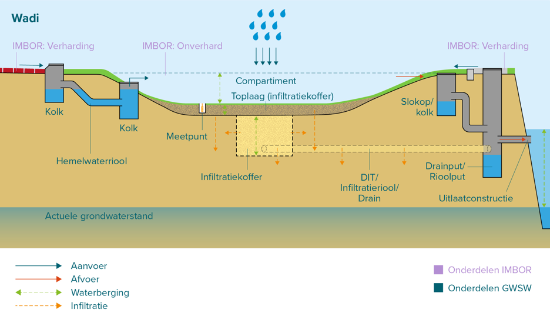

# Beheer Infiltratievoorzieningen

Stichting RIONED is initiatiefnemer en eigenaar van dit GitHub-project, Eric Oosterom is de verantwoordelijk projectmanager. 

Vragen over deze website en het GWSW kunt u stellen via gwsw@rioned.org. 

# Inleiding

## Aanleiding

Vanuit het programma hemelwatervoorzieningen van RIONED bestaat de behoefte aan goede beschrijvingen van (beheer van) infiltratievoorzieningen wat gebruikt kan worden om GWSW-definities op te stellen. De wens bestaat hierbij om:
- Een gemeenschappelijk beeld/taal te krijgen van/over infiltratievoorzieningen
- (de eerste) stappen worden gezet om het beheer van infiltratievoorzieningen op te nemen in beheerapplicaties

- Daarnaast bestaat op termijn de wens om ook de bescherming van infiltratievoorzieningen (via goed databeheer) ter verbeteren.

Aan Sweco (Elwin Leusink), infralytics (Wouter van Riel) en TAUW (Erwin Stamsnijder) is gevraagd dit verder inhoudelijk in te vullen in samenwerking met de begeleidingscommissie.

## Achtergrond en wens
Gemeenten geven aan dat infiltratievoorzieningen niet/heel beperkt in hun beheerapplicaties zijn opgenomen. Er zijn vragen over wat je moet opnemen onder ‘riolering’ en wat onder ‘groen’ en ‘wegen’, als je alle onderdelen van de voorziening goed wilt laten functioneren.

Gemeenten en bedrijven ervaren soms onduidelijkheid over de categorisering en definiëring van infiltratievoorzieningen. Bijvoorbeeld: is waterinfiltrerende verharding een categorie op zich zichzelf of is het eigenlijk een holle ruimte voorziening? Ander voorbeeld: een wadi is “Een (beplante) laagte, bestemd om het hemelwater tijdelijk te bergen en in de bodem te laten infiltreren. Voorzien van een infiltratiebed en veelal van infiltratiekratten.” Een infiltratiegreppel is “Een natuurlijk open reservoir met waterdoorlatende wanden voor de tijdelijke berging van hemelwater, waarbij het hemelwater door middel van infiltratie door de wanden kan worden afgevoerd.” Hierbij zien sommige gemeenten het infiltratiebed en de infiltratiekratten niet als noodzakelijk om het een wadi te laten zijn maar wel dat er een drain onder ligt. Dan lijkt het erg op de infiltratiegreppel. Men geeft aan dat er behoefte is aan een beschrijving die makkelijk te begrijpen is, zodat iedereen over hetzelfde praat (beleidsmedewerkers, ontwerpers, RO, beheerders, aannemers, etc.).

Tot slot ziet men dat de bescherming van infiltratievoorzieningen nog niet goed is geregeld. Waar leidingen via de Klic een vorm van bescherming hebben, is er niet zoiets voor infiltratievoorzieningen. Er zijn voorbeelden van wadi’s die dicht worden gegooid en kabels die door infiltratievoorzieningen worden getrokken.

Van daaruit bestaat er landelijk de behoefte om:
1. Het makkelijker te maken om gegevens over infiltratievoorzieningen op te nemen in beheerapplicaties.
2. Een heldere beschrijving en herkenbare definities te krijgen, binnen een duidelijke categorisering.
3. Opties beschrijven om (de werking van) infiltratievoorzieningen te beschermen door de locatie en werking te registeren.

## Aanpak op hoofdlijnen

### Beschrijving, definities, categorisering van infiltratievoorzieningen
In GWSW en de Kennisbank is een inhoudelijke basis gelegd over infiltratievoorzieningen en onderdelen. Deze informatie is echter niet overal volledig en sluit niet overal goed op elkaar aan. Op basis van hetgeen reeds beschikbaar is wordt binnen de opdracht gewerkt aan een visualisatie en beschrijving van de infiltratievoorzieningen en onderdelen. De  visualisatie heeft als doel de herkenbaarheid en het onderscheid van infiltratievoorzieningen te verbeteren. De definities en functies zijn bedoeld om een duidelijker onderscheid en categorisering aan te brengen waardoor de kennisbank en GWSW op termijn beter op elkaar aansluiten en de definities ook passen binnen GWSW.

Ten aanzien van de onderdelen zal nagegaan worden of hierin meer uniformering en vereenvoudiging mogelijk is. Een infiltratiekoffer verschilt bijvoorbeeld qua functie niet van een infiltratie-unit (behalve het kenmerk dat in de één aggregaat is aangebracht en de ander bestaat uit holle ruimte). Getracht zal worden de veelvoud aan onderdelen van infiltratievoorzieningen in overleg met de begeleidingscommissie (onderbouwd) te reduceren.

### Infiltratievoorzieningen en grondwatervoorzieningen in beheerapplicaties
Samen met de begeleidingscommissie worden wensen voor registratie van infiltratievoorzieningen geïnventariseerd:
- Wat is nodig voor goede registratie van de object- en systeemgegevens?
- Wat is daarvoor nodig in het GWSW? (Er zijn ‘basis’- gegevens nodig over ligging en inhoud, maar ook meetgegevens om het onderhoud goed uit te voeren. Wat is er exact nodig?)
- Wat is haalbaar om op te nemen in GWSW 1.7 (deadline maart 2025) of wat in een volgende GWSW-versie zal komen?

Vanuit deze inventarisatie wordt een voorstel gemaakt voor een exacte definitie, functie(s) en onderdelen van infiltratievoorzieningen. Deze worden zo opgesteld dat ze passen binnen GWSW en IMBOR en ook duidelijk is wat de aanpassing is t.o.v. de kennisbank en GWSW.

Daarnaast zal een voorstel worden gemaakt om wensen voor monitoring, onderhoud en beheerinformatie van infiltratievoorzieningen (bijvoorbeeld documentatie over de voorziening) een plek te geven binnen de GWSW.

### Fasering

1. Beschrijving voorzieningen vanuit fysiek en hydraulisch oogpunt
2. Afstemming van objecten in de openbare ruimte met CROW
3. Beschrijving van maatregelen aan infiltratievoorziening en benodigde informatiebehoefte, zoals ontwerptekeningen en porositeitsmetingen

## Beoogd eindresultaat

De werkzaamheden zullen leiden tot een voorstel voor:
- Visueel overzicht van alle hoofdtypen infiltratievoorzieningen met onderdelen
- Beschrijving van de definities en functies van infiltratievoorzieningen  
- Beschrijving onderdelen van infiltratievoorzieningen  

Daarnaast levert het een voorzet over hoe dit in het GWSW deelmodel en in het IMBOR dan zal moeten landen.

# Beoogde toepassing

- Uitbreiden van termen en difinities: rijker maken van het woordenboek
- Beschrijving opstellen zodat hydraulische modellering van infiltratievoorzieningen mogelijk wordt
- Beschrijving zodat beheermaatregelen mogelijk zijn

# Afbakening

De volgende soorten infiltratievoorzieningen zullen worden meegenomen.

Bron?

| Categorie                     | Infiltratievoorziening                           | Beschrijving                                                                                                                                                                                                                                                                                                                                                                                                                                                                   |
|-------------------------------|--------------------------------------------------|--------------------------------------------------------------------------------------------------------------------------------------------------------------------------------------------------------------------------------------------------------------------------------------------------------------------------------------------------------------------------------------------------------------------------------------------------------------------------------|
| Groene infiltratievelden      | Wadi                                             | Een verdiept (beplant) terrein,  bestemd om het hemelwater tijdelijk te bergen en in de bodem te laten infiltreren. De bodem van de wadi is aangepast om hemelwater te kunnen infiltreren en vast te houden, bijvoorbeeld met een infiltratiebed of infiltratiekratten.                                                                                                                                                                                                        |
| Groene infiltratievelden      | Infiltratieveld                                  | Een verdiept terrein, bestemd om het hemelwater tijdelijk te bergen en in de bodem te laten infiltreren. Er is een waterdoorlatende bodem.                                                                                                                                                                                                                                                                                                                                     |
| Groene infiltratievelden      | Infiltratiegreppel                               | Gelijk aan infiltratieveld, maar dan in de vorm van een greppel.                                                                                                                                                                                                                                                                                                                                                                                                               |
| Groene infiltratievelden      | Infiltratieberm                                  | Gelijk aan infiltratieveld, maar dan in de vorm van een berm.                                                                                                                                                                                                                                                                                                                                                                                                                  |
| Horizontale infiltratiebuizen | Infiltratieriool                                 | Een rioolleiding met waterdoorlatende wanden bestemd voor de inzameling en transport van hemelwater, waarbij het hemelwater door middel van infiltratie door de wanden kan worden afgevoerd. Kan ook beschouwd worden als een soort infiltratievoorziening.                                                                                                                                                                                                                    |
| Verticale infiltratiebuizen   | Infiltratieput                                   | Een put met waterdoorlatende wanden bestemd voor de inzameling van hemelwater, waarbij het hemelwater door middel van infiltratie door de wanden kan worden afgevoerd                                                                                                                                                                                                                                                                                                          |
| Holle ruimte voorzieningen    | Infiltratie-unit                                 | Een constructie die een ondergrondse open ruimte geeft en waterdoorlatende wanden heeft, waarbij het hemelwater door middel van infiltratie door de wanden kan worden afgevoerd.                                                                                                                                                                                                                                                                                               |
| Holle ruimte voorzieningen    | Infiltratiekoffer                                | Een infiltratiekoffer is een constructie die met een aggregaat gevuld is. De infiltratiekoffer kan water bufferen. Het aggregaat kan bestaan uit verschillende materialen, zoals grind, lava-slakken, geëxpandeerde kleikorrels en puin. Ook bestaan er toepassingen met steenwol. De holle ruimten tussen het aggregaat bufferen het regenwater, waarna het water in de bodem kan infiltreren. Een drain in het aggregaat kan voor de invoer en afvoer van regenwater zorgen. |
| Infiltrerende wegconstructies | Waterdoorlatende verharding (poreuze steen)      | Een waterdoorlatende verharding bestaat uit poreus (bestratings)materiaal dat regenwater doorlaat. Hieronder ligt een wegfundering die het infiltrerende hemelwater kan bergen en infiltreren.                                                                                                                                                                                                                                                                                 |
| Infiltrerende wegconstructies | Waterdoorlatende verharding (infiltrerende voeg) | De waterpasserende verharding heeft vergrote voegen. De stenen hebben nokken aan de zijkant waardoor het water passeert, of er is op een andere wijze gezorgd voor infiltratie via de voeg. Hieronder ligt een wegfundering die het infiltrerende hemelwater kan bergen en infiltreren.                                                                                                                                                                                        |
| Infiltrerende wegconstructies | Halfverharding                                   | Halfverharding bestaat uit doorlatend materiaal aan het maaiveld. Hieronder ligt een wegfundering die het infiltrerende hemelwater kan bergen en infiltreren.                                                                                                                                                                                                                                                                                                                  |

De beschijving van de infiltratievoorzieningen focust het spectief van de hydraulische opbouw van een voorziening. Dat houdt in: de voorziening is het geheel der delen, waarbij ieder onderdeel apart wordt beschreven. Hiermee wordt het mogelijk om de hydraulische werking van de gehele voorziening te schematiseren.

# Soorten infiltratievoorzieningen

In onderstaande paragrafen zijn diverse infiltratievoorzieningen gevisualiseerd. Alle termen die in de visualisaties voorkomen, komen uit het GWSW. Op sommige plaatsen komen termen uit het <a href="https://imbor-viewer.apps.crow.nl" target="_blank">IMBOR</a> voor. Dit is dan ook expliciet aangegeven.

In de visualisatie staan pijlen met diverse kleuren. In onderstaande legenda is de betekenis weergegeven.

## Wadi
 

Definitie Wadi

Een verdiept terrein, bestemd om het hemelwater tijdelijk te bergen, voorzien van waterdoorlatende bodem waardoor water door middel van infiltratie door de bodem kan worden afgevoerd.

## Infiltratie-unit
 

Definitie Infiltratie-unit

Een constructie die een ondergrondse open ruimte geeft en waterdoorlatende wanden heeft, waarbij het hemelwater door middel van infiltratie door de wanden kan worden afgevoerd.

## Infiltratieveld
 

Definitie Infiltratieveld

Een verdiept terrein, bestemd om het hemelwater tijdelijk te bergen en in de bodem te laten infiltreren. Er is een waterdoorlatende bodem.

## Infiltratiegreppel
 

Definitie Infiltratirgreppel

Een infiltratieveld, in de vorm van een greppel.

## Infiltratiekoffervoorziening
 

Definitie Infiltratiekoffervoorziening

Een infiltratiekoffer is een infiltratievoorziening met een infiltratiekoffer. De infiltratiekoffer is gevuld met een substraat en kan water bufferen. Het substraat kan bestaan uit verschillende materialen, zoals grind, steenwol, lava, zand en puin. Een drain in het aggregaat kan voor de invoer en afvoer van regenwater zorgen.

## Infiltratieputvoorziening
 

Definitie Infiltratieputvoorziening

Een infiltratieputvoorziening is een infiltratievoorziening met een infiltratieput. De put heeft waterdoorlatende wanden bestemd voor de inzameling van hemelwater, waarbij het hemelwater door middel van infiltratie door de wanden kan worden afgevoerd.

## Infiltratierioolvoorziening
 

Definitie Infiltratierioolvoorziening

Een infiltratierioolvoorziening is een infiltratievoorziening met een infiltratieriool. Het infiltratieriool heeft waterdoorlatende wanden bestemd voor de inzameling van hemelwater, waarbij het hemelwater door middel van infiltratie door de wanden kan worden afgevoerd.

## Waterdoorlatende verharding
 

Definitie Waterdoorlatende verharding

Een waterdoorlatende verharding bestaat uit poreus bestratingsmateriaal dat regenwater doorlaat. Hieronder ligt een wegfundering die het infiltrerende hemelwater kan bergen en infiltreren.

## Waterpasserende verharding
 

Definitie Waterpasserende verharding

Een waterdoorpasserende verharding bestaat uit bestratingsmateriaal waarbij de bestratingsvoegen het regenwater doorlaat. Hieronder ligt een wegfundering die het infiltrerende hemelwater kan bergen en infiltreren.

## Waterbergende en infiltrerende fundatie
 

Definitie Waterbergende en infiltrerende fundatie

Een waterdoorlatende verharding bestaat uit poreus bestratingsmateriaal dat regenwater doorlaat. Hieronder ligt een wegfundering die het infiltrerende hemelwater kan bergen en infiltreren.

## Halfverharding
 

Definitie Halfverharding

Halfverharding bestaat uit doorlatend materiaal aan het maaiveld. Hieronder ligt een wegfundering die het infiltrerende hemelwater kan bergen en infiltreren.

# Wijzigingen in het GWSW
In deze paragrafen worden de wijzigingen voor het GWSW gepresenteerd.

Onderstaand schema biedt een overzicht van de wijzigingen in de soortenboom voor infiltratievoorzieningen.

| Huidige soortenboom                                                                                                                                                                                                                                                                                          | Voorstel soortenboom                                                                                                                                                                                                                                                                                                                                                                                                                                                                                                                                                    |
|--------------------------------------------------------------------------------------------------------------------------------------------------------------------------------------------------------------------------------------------------------------------------------------------------------------|-------------------------------------------------------------------------------------------------------------------------------------------------------------------------------------------------------------------------------------------------------------------------------------------------------------------------------------------------------------------------------------------------------------------------------------------------------------------------------------------------------------------------------------------------------------------------|
| - Reservoir    - Bergbezinkbassin    - Bergingsbassin    - Bergingsvijver    - Bezinkbassin    - Infiltratiereservoir       - Grindkoffer       - Infiltratiebassin       - Infiltratiegreppel       - Lavakoffer       - Steenwolkoffer       - Wadi       - Zandkoffer | - Reservoir    - Bergbezinkbassin    - Bergingsbassin    - Bergingsvijver    - Bezinkbassin    - Infiltratiereservoir > Infiltratievoorziening        - ~~Grindkoffer~~       - ~~Infiltratiebassin~~       - ~~Lavakoffer~~       - ~~Steenwolkoffer~~       - Wadi       - ~~Zandkoffer~~        - Infiltratieveld          - Infiltratiegreppel       - Infiltratierioolvoorziening       - Infiltratieputvoorziening       - Infiltratie-unit       - Infiltratiekoffervoorziening |

## Concepten, kenmerken en relaties

| Concept | Definitie |
|---------|-----------|
|         |           |
|         |           |
|         |           |
|         |           |
|         |           |
|         |           |
|         |           |
|         |           |
|         |           |

