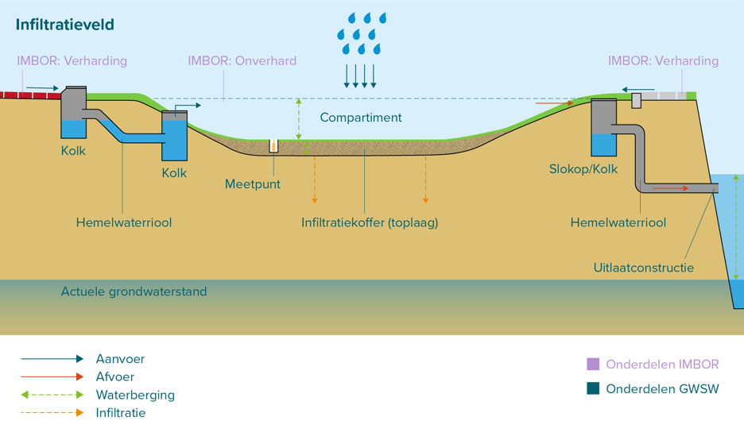
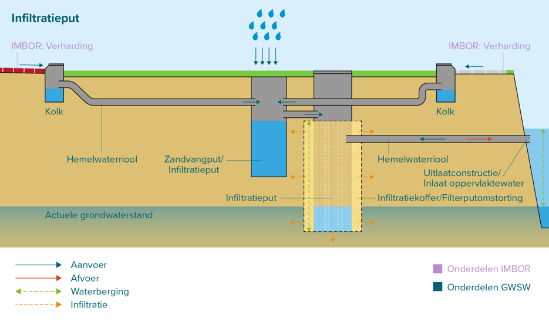
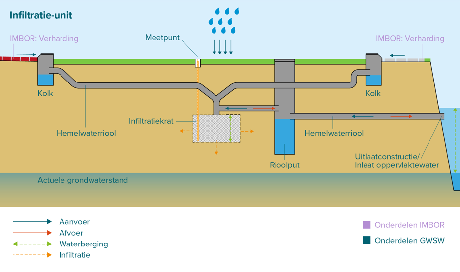

# Uniforme registratie infiltratievoorzieningen

Stichting RIONED is initiatiefnemer en eigenaar van dit GitHub-project, Eric Oosterom is de verantwoordelijk projectmanager.

HUIDIGE STATUS: Dit is een concept-beschrijving die nog niet behandeld is door de GWSW modelleurs, niet is besproken door de werkgroep GWSW-Basis, nog niet  publiek geconsulteerd is en dus nog geen enkele formele status heeft. Deze stappen zullen in Q3 en Q4 2025 doorlopen worden en dit deelmodel GWSW Infiltratievoorzieningen is beoogd zoveel mogelijk opgenomen te worden in GWSW versie 1.7 per januari 2026. 

Vragen over deze website en het GWSW kunt u stellen via gwsw@rioned.org.

# Inleiding

## Aanleiding

Vanuit het programma hemelwatervoorzieningen van RIONED bestaat de behoefte aan goede beschrijvingen van (beheer van) infiltratievoorzieningen wat gebruikt kan worden om GWSW-definities op te stellen. De wens bestaat hierbij om:
- Een gemeenschappelijk beeld/taal te krijgen van/over infiltratievoorzieningen
- (de eerste) stappen worden gezet om het beheer van infiltratievoorzieningen op te nemen in beheerapplicaties
- Daarnaast bestaat op termijn de wens om ook de bescherming van infiltratievoorzieningen (via goed databeheer) te verbeteren.

Aan Sweco (Elwin Leusink), infralytics (Wouter van Riel) en TAUW (Erwin Stamsnijder) is gevraagd dit verder inhoudelijk in te vullen in samenwerking met de begeleidingscommissie.

## Achtergrond en wens
Gemeenten geven aan dat infiltratievoorzieningen niet/heel beperkt in hun beheerapplicaties zijn opgenomen. Er zijn vragen over wat je moet opnemen onder ‘riolering’ en wat onder ‘groen’ en ‘wegen’, als je alle onderdelen van de voorziening goed wilt laten functioneren.

Gemeenten en bedrijven ervaren soms onduidelijkheid over de categorisering en definiëring van infiltratievoorzieningen. Bijvoorbeeld: is waterinfiltrerende verharding een categorie op zich zichzelf of is het eigenlijk een holle ruimte voorziening? Ander voorbeeld: een wadi is “Een (beplante) laagte, bestemd om het hemelwater tijdelijk te bergen en in de bodem te laten infiltreren. Voorzien van een infiltratiebed en veelal van infiltratiekratten.” Een infiltratiegreppel is “Een natuurlijk open reservoir met waterdoorlatende wanden voor de tijdelijke berging van hemelwater, waarbij het hemelwater door middel van infiltratie door de wanden kan worden afgevoerd.” Hierbij zien sommige gemeenten het infiltratiebed en de infiltratiekratten niet als noodzakelijk om het een wadi te laten zijn maar wel dat er een drain onder ligt. Dan lijkt het erg op de infiltratiegreppel. Men geeft aan dat er behoefte is aan een beschrijving die makkelijk te begrijpen is, zodat iedereen over hetzelfde praat (beleidsmedewerkers, ontwerpers, RO, beheerders, aannemers, etc.).

Tot slot ziet men dat de bescherming van infiltratievoorzieningen nog niet goed is geregeld. Waar leidingen via de Klic een vorm van bescherming hebben, is er niet zoiets voor infiltratievoorzieningen. Er zijn voorbeelden van wadi’s die dicht worden gegooid en kabels die door infiltratievoorzieningen worden getrokken.

Van daaruit bestaat er landelijk de behoefte om:
1. Het makkelijker te maken om gegevens over infiltratievoorzieningen op te nemen in beheerapplicaties.
2. Een heldere beschrijving en herkenbare definities te krijgen, binnen een duidelijke categorisering.
3. Opties beschrijven om (de werking van) infiltratievoorzieningen te beschermen door de locatie en werking te registeren.

## Aanpak op hoofdlijnen

### Beschrijving, definities, categorisering van infiltratievoorzieningen
In GWSW en de Kennisbank is een inhoudelijke basis gelegd over infiltratievoorzieningen en onderdelen. Deze informatie is echter niet overal volledig en sluit niet overal goed op elkaar aan. Op basis van hetgeen reeds beschikbaar is wordt binnen de opdracht gewerkt aan een visualisatie en beschrijving van de infiltratievoorzieningen en onderdelen. De  visualisatie heeft als doel de herkenbaarheid en het onderscheid van infiltratievoorzieningen te verbeteren. De definities en functies zijn bedoeld om een duidelijker onderscheid en categorisering aan te brengen waardoor de kennisbank en GWSW op termijn beter op elkaar aansluiten en de definities ook passen binnen GWSW.

Ten aanzien van de onderdelen wordt nagegaan of hierin meer uniformering en vereenvoudiging mogelijk is. Een infiltratiekoffer verschilt bijvoorbeeld qua functie niet van een infiltratie-unit (behalve het kenmerk dat in de één aggregaat is aangebracht en de ander bestaat uit holle ruimte). Getracht wordt de veelvoud aan onderdelen van infiltratievoorzieningen in overleg met de begeleidingscommissie (onderbouwd) te reduceren.

### Infiltratievoorzieningen en grondwatervoorzieningen in beheerapplicaties
Samen met de begeleidingscommissie worden wensen voor registratie van infiltratievoorzieningen geïnventariseerd:
- Wat is nodig voor goede registratie van de object- en systeemgegevens?
- Wat is nodig voor goede registratie van de onderhouds- en beheergegevens (conditie, metingen)?
- Wat is nodig voor analyse van (hydraulisch) functioneren?

Op basis van de hier gespecificeerde gegevensbehoefte zal met het GWSW modelleerteam van Stichting RIONED worden bepaald hoe dit in het GWSW-datamodel opgenomen kan worden en welke zaken bij voorkeur juist in het IMBOR (van CROW) terecht moet komen. IMBOR 2025 wordt in juni 2025 gepubliceerd, dus we zullen ons richten op de wijzigingsverzoeken voor de daaropvolgende versie. Geprobeerd wordt om zoveel mogelijk op te nemen in GWSW 1.7 (deadline augustus 2025) en anders in de eerstvolgende GWSW-versie.

Vanuit deze inventarisatie wordt een voorstel gemaakt voor een exacte definitie, functie(s) en onderdelen van infiltratievoorzieningen. Deze worden zo opgesteld dat ze passen binnen GWSW en IMBOR en ook duidelijk is wat de aanpassing is t.o.v. de kennisbank en GWSW.

Daarnaast wordt een voorstel gemaakt om wensen voor monitoring, onderhoud en beheerinformatie van infiltratievoorzieningen (bijvoorbeeld documentatie over de voorziening) een plek te geven binnen het GWSW.

### Fasering

1. Beschrijving voorzieningen vanuit fysiek en hydraulisch oogpunt
2. Afstemming van objecten in de openbare ruimte met CROW
3. Beschrijving van maatregelen aan infiltratievoorziening en benodigde informatiebehoefte, zoals ontwerptekeningen en porositeitsmetingen

## Beoogd eindresultaat

De werkzaamheden zullen leiden tot een voorstel voor:
- Visueel overzicht van alle hoofdtypen infiltratievoorzieningen met onderdelen
- Beschrijving van de definities en functies van infiltratievoorzieningen
- Beschrijving onderdelen van infiltratievoorzieningen, zodat registratie mogelijk is

Daarnaast levert het een voorzet over hoe dit in het GWSW deelmodel en in het IMBOR dan zal moeten landen.

# Beoogde toepassing

- Uitbreiden van termen en definities: rijker maken van het woordenboek
- Beschrijving opstellen zodat hydraulische modellering van infiltratievoorzieningen mogelijk wordt
- Beschrijving zodat registratie van beheermaatregelen mogelijk zijn

# Huidige situatie: soorten infiltratievoorzieningen

## Overzicht infiltratievoorzieningen in het GWSW en de kennisbank

In het GWSW en de Kennisbank van Stichting RIONED staan verschillende benamingen, definities, functies en onderdelen van infiltratievoorzieningen. In onderstaande tabel staan de verschillende benamingen beschreven.

| Type                          | Kennisbank                                                                                                                                                                                                                                                                                        | GWSW                                                                                                                     |
|-------------------------------|---------------------------------------------------------------------------------------------------------------------------------------------------------------------------------------------------------------------------------------------------------------------------------------------------|--------------------------------------------------------------------------------------------------------------------------|
| Groene infiltratievelden      | <a href="https:/www.riool.net/kennisbank/water-en-klimaat/stelsels-en-voorzieningen-in-het-stedelijk-watersysteem/voorzieningen-in-een-stedelijk-watersysteem/beschrijving-van-een-wadi" target="_blank">Wadi</a>                                                                                 | <a href="https:/data.gwsw.nl/totaal/Wadi" target="_blank">Wadi</a>                                                       |
| Groene infiltratievelden      | <a href="https:/www.riool.net/kennisbank/water-en-klimaat/stelsels-en-voorzieningen-in-het-stedelijk-watersysteem/voorzieningen-in-een-stedelijk-watersysteem/beschrijving-van-een-infiltratieveld" target="_blank">Infiltratieveld</a>                                                           | <a href="https:/data.gwsw.nl/totaal/Wadi" target="_blank">Wadi</a> (synoniem van Infiltratieveld)                        |
| Groene infiltratievelden      | <a href="https:/www.riool.net/kennisbank/water-en-klimaat/stelsels-en-voorzieningen-in-het-stedelijk-watersysteem/voorzieningen-in-een-stedelijk-watersysteem/beschrijving-van-een-greppel" target="_blank">Greppel</a>                                                                           | <a href="https:/data.gwsw.nl/totaal/Infiltratiegreppel" target="_blank">Infiltratiegreppel</a>                           |
| Groene infiltratievelden      | <a href="https:/www.riool.net/kennisbank/water-en-klimaat/stelsels-en-voorzieningen-in-het-stedelijk-watersysteem/voorzieningen-in-een-stedelijk-watersysteem/beschrijving-van-een-infiltrerende-berm" target="_blank">Infiltratieberm en (infiltrerende) berm</a>                                | <a href="https:/data.gwsw.nl/totaal/Bermsloot" target="_blank">Bermsloot</a>                                             |
| Horizontale infiltratiebuizen | <a href="https:/www.riool.net/kennisbank/water-en-klimaat/stelsels-en-voorzieningen-in-het-stedelijk-watersysteem/voorzieningen-in-een-stedelijk-watersysteem/beschrijving-van-een-infiltratieriool" target="_blank">Infiltratieriool</a>                                                         | <a href="https:/data.gwsw.nl/totaal/Infiltratieriool" target="_blank">Infiltratieriool</a>                               |
| Verticale infiltratiebuizen   | <a href="https:/www.riool.net/kennisbank/water-en-klimaat/stelsels-en-voorzieningen-in-het-stedelijk-watersysteem/voorzieningen-in-een-stedelijk-watersysteem/beschrijving-van-een-infiltratieput" target="_blank">Infiltratieput</a>                                                             | <a href="https:/data.gwsw.nl/totaal/Infiltratieput" target="_blank">Infiltratieput</a>                                   |
| Verticale infiltratiebuizen   | <a href="https:/www.riool.net/kennisbank/water-en-klimaat/stelsels-en-voorzieningen-in-het-stedelijk-watersysteem/voorzieningen-in-een-stedelijk-watersysteem/beschrijving-van-een-infiltratiekolk" target="_blank">Infiltratiekolk</a>                                                           | <a href="https:/data.gwsw.nl/totaal/Infiltratiekolk" target="_blank">Infiltratiekolk</a>                                 |
| Holle ruimte voorzieningen    | <a href="https:/www.riool.net/kennisbank/water-en-klimaat/stelsels-en-voorzieningen-in-het-stedelijk-watersysteem/voorzieningen-in-een-stedelijk-watersysteem/beschrijving-van-een-infiltratie-element" target="_blank">Infiltratie-unit en Infiltratie-element</a>                               | <a href="https:/data.gwsw.nl/totaal/Infiltratiekrat" target="_blank">Infiltratiekrat</a>                                 |
| Holle ruimte voorzieningen    | <a href="https:/www.riool.net/kennisbank/water-en-klimaat/stelsels-en-voorzieningen-in-het-stedelijk-watersysteem/voorzieningen-in-een-stedelijk-watersysteem/beschrijving-van-een-infiltratie-element" target="_blank">Infiltratiekoffer en Infiltratie-element</a>                              | <a href="https:/data.gwsw.nl/totaal/Grindkoffer" target="_blank">Grindkoffer, Lavakoffer, Zandkoffer, Steenwolkoffer</a> |
| Infiltrerende wegconstructies | <a href="https:/www.riool.net/kennisbank/water-en-klimaat/stelsels-en-voorzieningen-in-het-stedelijk-watersysteem/voorzieningen-in-een-stedelijk-watersysteem/beschrijving-van-een-infiltrerend-cunet" target="_blank">Waterdoorlatende verharding (poreuze steen) en Infiltrerend Cunet</a>      |                                                                                                                          |
| Infiltrerende wegconstructies | <a href="https:/www.riool.net/kennisbank/water-en-klimaat/stelsels-en-voorzieningen-in-het-stedelijk-watersysteem/voorzieningen-in-een-stedelijk-watersysteem/beschrijving-van-een-infiltrerend-cunet" target="_blank">Waterdoorlatende verharding (infiltrerende voeg) en Infiltrerend Cunet</a> |                                                                                                                          |
| Infiltrerende wegconstructies | <a href="https:/www.riool.net/kennisbank/water-en-klimaat/stelsels-en-voorzieningen-in-het-stedelijk-watersysteem/voorzieningen-in-een-stedelijk-watersysteem/beschrijving-van-een-infiltrerend-cunet" target="_blank">Halfverharding en Infiltrerend Cunet</a>                                   |                                                                                                                          |
| Infiltrerende wegconstructies | <a href="https:/www.riool.net/kennisbank/water-en-klimaat/stelsels-en-voorzieningen-in-het-stedelijk-watersysteem/voorzieningen-in-een-stedelijk-watersysteem/beschrijving-van-een-infiltrerend-cunet" target="_blank">Infiltrerend Cunet</a>                                                     |                                                                                                                          |
| Infiltrerende wegconstructies |                                                                                                                                                                                                                                                                                                   | <a href="https:/data.gwsw.nl/totaal/Infiltratiegoot" target="_blank">Infiltratiegoot</a>                                 |
| Infiltratiereservoir          |                                                                                                                                                                                                                                                                                                   | <a href="https:/data.gwsw.nl/totaal/Infiltratiebassin" target="_blank">Infiltratiebassin</a>                             |

## Definities infiltratievoorzieningen

In onderstaande tabel staan de definities van infiltratievoorzieningen in de kennisbank en het GWSW. Indien er geen GWSW definitie beschikbaar is, is de definitie uit het IMBOR weergegeven.

| Voorziening                 | Definitie kennisbank                                                                                                                                                                                                                                                                                                                                                                                                                                                                                                                                                                                                                              | Definitie GWSW (en IMBOR indien niet beschikbaar in het GWSW)                                                                                                                                                                                              | 
|-----------------------------|---------------------------------------------------------------------------------------------------------------------------------------------------------------------------------------------------------------------------------------------------------------------------------------------------------------------------------------------------------------------------------------------------------------------------------------------------------------------------------------------------------------------------------------------------------------------------------------------------------------------------------------------------|------------------------------------------------------------------------------------------------------------------------------------------------------------------------------------------------------------------------------------------------------------|
| Wadi                        | Een wadi is een begroeide, onverharde verlaging in het maaiveld waarin het hemelwater wordt verzameld, dat vervolgens via een zuiverende bodempassage infiltreert in de ondergrond. Bij overbelasting heeft de verlaging een overloop. In de ondergrond heeft de wadi een drainageleiding en eventueel infiltratie-elementen.                                                                                                                                                                                                                                                                                                                     | Een verdiept terrein, bestemd om het hemelwater tijdelijk te bergen, voorzien van waterdoorlatende bodem waardoor water door middel van infiltratie door de bodem kan worden afgevoerd.                                                                    | 
| Infiltratieveld             | Een infiltratieveld bestaat altijd uit een verlaging in het maaiveld (het bassin) en een doorlatende toplaag. Er zijn allerlei varianten mogelijk in omvang en inrichting. Het principe is altijd hetzelfde.                                                                                                                                                                                                                                                                                                                                                                                                                                      | Gelijk aan definitie Wadi.                                                                                                                                                                                                                                 | 
| Infiltratiegreppel          | Greppels zijn onverharde geulen, vaak begroeid met gras, die gebruikt worden voor de afvoer van ingezameld hemelwater.                                                                                                                                                                                                                                                                                                                                                                                                                                                                                                                            | Een natuurlijk open reservoir met waterdoorlatende wanden voor de tijdelijke berging van hemelwater, waarbij het hemelwater door middel van infiltratie door de wanden kan worden afgevoerd.                                                               | 
| Infiltratieberm             | Een infiltrerende berm is een strook grond langs een weg, tussen rijstroken of tussen een rijweg en een fiets- of voetpad in die het afstromende hemelwater van de verharding ernaast laat infiltreren. Dit kan bedoeld zijn om (schoon) water niet af te voeren, om grondwater aan te vullen en ook om de beplanting in bermen van voldoende water te voorzien.                                                                                                                                                                                                                                                                                  |                                                                                                                                                                                                                                                            | 
| Infiltratieriool            | Het doel van een infiltratieriool is het in de bodem brengen en soms bergen van ingezameld hemelwater. Een infiltratieriool is een leiding met een buiswand waar water doorheen kan. De wand is gemaakt van poreus materiaal of er zijn openingen in de buiswand aangebracht. Hierdoor kan het water vanuit de buis via de wand in de bodem infiltreren.                                                                                                                                                                                                                                                                                          | Een rioolleiding met waterdoorlatende wanden bestemd voor de inzameling en transport van hemelwater, waarbij het hemelwater door middel van infiltratie door de wanden kan worden afgevoerd. Kan ook beschouwd worden als een soort infiltratievoorziening | 
| Infiltratieput              | Infiltratieputten zijn verticaal in de grond geplaatste buizen van kunststof of beton die aan de onderzijde meestal open zijn. Vaak zijn de zijkanten voorzien van gaten of sleuven of zijn deze gemaakt van poreus materiaal, waardoor hemelwater in de omliggende bodem kan infiltreren. Infiltratieputten worden ook wel zink- of zakputten genoemd.                                                                                                                                                                                                                                                                                           | Een put met waterdoorlatende wanden bestemd voor de inzameling van hemelwater, waarbij het hemelwater door middel van infiltratie door de wanden kan worden afgevoerd                                                                                      | 
| Infiltratiekolk             | Infiltratiekolken zijn kolken waarvan de onderbak is voorzien van openingen of van poreuze wanden en een poreuze bodem, waardoor het hemelwater in de ondergrond kan infiltreren.                                                                                                                                                                                                                                                                                                                                                                                                                                                                 | Een kolk met waterdoorlatende wanden bestemd voor de inzameling van hemelwater, waarbij het hemelwater door middel van infiltratie door de wanden kan worden afgevoerd. Kan ook beschouwd worden als een soort infiltratievoorziening.                     | 
| Infiltratie-unit            | Infiltratie-elementen zijn ondergrondse voorzieningen die hemelwater bergen en van waaruit ingezameld hemelwater infiltreert in de omliggende bodem. Infiltratie-elementen hebben een holle ruimte in de poriën van een substraat, lavakorrels, steenwolelementen, grind, of tussen (geperforeerde) wanden.                                                                                                                                                                                                                                                                                                                                       | Een krat met waterdoorlatende wanden bestemd voor de inzameling van hemelwater, waarbij het hemelwater door middel van infiltratie door de wanden kan worden afgevoerd.                                                                                    | 
| Infiltratiekoffer           | Infiltratie-elementen zijn ondergrondse voorzieningen die hemelwater bergen en van waaruit ingezameld hemelwater infiltreert in de omliggende bodem. Infiltratie-elementen hebben een holle ruimte in de poriën van een substraat, lavakorrels, steenwolelementen, grind, of tussen (geperforeerde) wanden.                                                                                                                                                                                                                                                                                                                                       | Een grindkoffer is (meestal) een kuil met worteldoek, gevuld met grind waar regenwater de tijd krijgt om langzaam in de bodem opgenomen te worden**                                                                                                        | 
| Waterdoorlatende verharding |                                                                                                                                                                                                                                                                                                                                                                                                                                                                                                                                                                                                                                                   | In IMBOR vorm van elementen verharding: Aaneengesloten verharding waarbij de porositeit van de afzonderlijke elementen een poreus oppervlak realiseert                                                                                                     | 
| Waterpasserende verharding  |                                                                                                                                                                                                                                                                                                                                                                                                                                                                                                                                                                                                                                                   | In IMBOR vorm van elementen verharding: Aaneengesloten verharding waarbij de voegen van de verharding een poreus oppervlak realiseren                                                                                                                      | 
| Halfverharding              |                                                                                                                                                                                                                                                                                                                                                                                                                                                                                                                                                                                                                                                   | In IMBOR vorm van verharding: Een verharding bestaand uit onsamenhangend materiaal dat meer draagkracht levert dan de originele grond                                                                                                                      | 
| Infiltratiecunet            | Een cunet is de funderingslaag die wordt gebruikt onder verharding (bijvoorbeeld een weg). Een cunet wordt daarom heel vaak toegepast. De grond waarop een weg wordt aangelegd, wordt afgegraven om in plaats hiervan een meer draagkrachtige laag aan te kunnen brengen, het cunet. Het doel hiervan is het vergroten van de draagkracht ten behoeve van wat erboven ligt. Als voor dit wegcunet geschikt materiaal wordt gebruikt, kan het ook een boel water bergen. Er wordt vaak rondom een voorziening voor drainage of infiltratie ook een laag grond vervangen. In dat geval altijd door goed doorlatend materiaal. Ook dit is een cunet. |                                                                                                                                                                                                                                                            | 
| Infiltratiegoot             |                                                                                                                                                                                                                                                                                                                                                                                                                                                                                                                                                                                                                                                   | Een goot met waterdoorlatende wanden bestemd voor de inzameling en transport van hemelwater, waarbij het hemelwater door middel van infiltratie door de wanden kan worden afgevoerd. Kan ook beschouwd worden als een soort infiltratievoorziening.        | 
| Infiltratiebassin           |                                                                                                                                                                                                                                                                                                                                                                                                                                                                                                                                                                                                                                                   | Een reservoir met waterdoorlatende wanden voor de tijdelijke berging van hemelwater, waarbij het hemelwater door middel van infiltratie door de wanden kan worden afgevoerd                                                                                | 

Uit het overzicht blijkt dat de definities op specifieke details en beschrijvingswijze verschillen. Ook blijkt dat er verschil kan zitten in de interpretatie van de definities. Een wadi zonder drain wordt bijvoorbeeld door veel gemeenten in Nederland wel als een wadi beschouwd, maar zou volgens de definities van de kennisbank een infiltratieveld moeten zijn.

Om meer inzicht te krijgen in de fysieke verschillen tussen de infiltratievoorzieningen zijn de infiltratievoorzieningen uit de kennisbank gevisualiseerd.

## Visualisatie infiltratievoorzieningen uit de kennisbank

Deze paragraaf visualiseerd diverse typen infiltratievoorzieningen, zodat een illustratief beeld wordt verkregen van het functioneren en opbouw van de diverse voozieningen. Aangezien infiltratievoorzieningen in de praktijk een bijna oneindige hoeveelheid verschijningsvormen hebben, is er hier gekozen om de kennisbank van Stichting RIONED (zie [Welke typen voorzieningen zijn er?](https://www.riool.net/kennisbank/ontwerp-en-beheermaatregelen/beheer-infiltratievoorzieningen/omschrijving-infiltratievoorzieningen/welke-typen-voorzieningen-zijn-er)) als uitgangspunt te hanteren.

Op sommige plaatsen komen termen uit het <a href="https:/imbor-viewer.apps.crow.nl" target="_blank">IMBOR</a> voor. Dit is dan ook expliciet aangegeven.

In de visualisatie staan pijlen met diverse kleuren. Deze kleuren representeren de stromingsrichting van het water.

### Wadi

### Infiltratieveld

### Infiltratiegreppel

### Infiltratieberm

### Infiltratieriool

### Infiltratieput

### Infiltratiekolk

### Infiltratie-unit

### Infiltratiekoffer

### Waterdoorlatende verharding

### Waterpasserende verharding

### Halfverharding

### Infiltratiecunet

# Gewenste situatie

## Procesgang
In de werkgroep is gediscussieerd over de diversiteit en onderscheid aan infiltratievoorzieningen en onderdelen daarvan. Voorwaarde voor opname in het GWSW is dat er duidelijke verschillen moeten bestaan tussen de voorzieningen. Voor de huidige infiltratievoorzieningen, zoals beschreven en gevisualiseerd in voorgaand hoofdstuk, is dat onderscheid onvoldoende aanwezig. In dat kader zijn diverse gesprekken met de begeleidingscommissie, gemeenten en gegevensbeheerders gevoerd waarbij input is opgehaald over de benodigde en gewenste afbakening van infiltratievoorzieningen, onderdelen en kenmerken voor opname in het GWSW.

Uit die diverse gesprekken zijn de volgende belangrijkste conclusies getrokken:

- De visualisaties van de infiltratievoorzieningen zoals in hoofdstuk 3 is herkenbaar en helpt bij het begrijpen van de werking van de voorzieningen.  
- Een aantal infiltratievoorzieningen die in de kennisbank en het GWSW worden onderscheiden lijken te veel op elkaar om deze afzonderlijk op te nemen in het GWSW. Het is wenselijk om het aantal voorzieningen voor het GWSW te reduceren tot een aantal onderscheidende hoofdgroepen. De grote gelijkenis van de voorzieningen wordt veroorzaakt doordat infiltratievoorzieningen in de praktijk in wisselende samenstellingen voor kunnen komen (bijvoorbeeld een wadi met als onderdeel een infiltratieput). Het is wenselijk om het aantal onderdelen (en hun kenmerken) te beperken tot een aantal echt onderscheidende onderdelen die in wisselende samenstelling (als bouwpakket) binnen een infiltratievoorziening kunnen worden toegepast.
- Onderhoud aan een infiltratievoorziening wordt uitgevoerd op onderdeelniveau. In dat kader is het goed kunnen beschrijven van de te beheren onderdelen (en hun kenmerken) cruciaal.
- Het is wenselijk dat onderdelen toegekend kunnen worden aan een bovenliggend niveau van de infiltratievoorziening. Daarmee kan het functioneren van het geheel van onderdelen worden getoetst (een afwateringsgebied wordt bijvoorbeeld gekoppeld op voorzieningniveau) en is het ook mogelijk om overkoepelende documentatie (geohydrologisch onderzoek bij locatiekeuze, ontwerpen, bestek, revisies, etc.) die ten grondslag liggen aan een infiltratievoorziening daaraan te relateren.

## Afbakening
De beschrijving van de infiltratievoorzieningen focust op het perspectief van de hydraulische en constructieve opbouw van een voorziening. Dat houdt in: de voorziening is het geheel der delen, waarbij ieder onderdeel apart wordt beschreven en zijn eigen constructieve en hydraulische kenmerken heeft. Hiermee wordt het mogelijk om de hydraulische werking van de gehele voorziening te schematiseren en is het mogelijk beheeractiviteiten te koppelen aan de onderdelen van de voorziening. 

Hier ligt een belangrijke relatie met GWSW HydX, Wibon en IMBOR. In dit project is uitwisselbaarheid hieromtrent niet nader uitgewerkt.

Er is gekozen de huidige infiltratievoorzieningen uit de kennisbank te reduceren tot drie hoofdtypen:
- Groen infiltratieveld
- Ondergrondse infiltratievoorziening
- Infiltrerende wegconstructie

De infiltrerende wegconstructie is als een aparte categorie opgenomen, los van de ondergrondse infiltratievoorzieningen. Deze keuze is gemaakt omdat de infiltrerende wegconstructie veel overeenkomsten vertoont met onderdelen (zoals verhardingen en constructielagen) die doorgaans alleen geregistreerd worden via het IMBOR. Deze onderdelen liggen op de grenzen van het werkveld van de stedelijk waterbeheerder, groenbeheerder en wegbeheerder. Aangezien deze onderdelen een aanzienlijke invloed hebben op het hydraulisch functioneren en het beheer van deze voorzieningen, evenals op het gehele functioneren van het rioolsysteem, is het wenselijk om deze in het GWSW te beschrijven. Bovendien is het nieuw dat de funderingslagen van deze constructie nu specifiek kunnen worden beschreven als een infiltratiekoffer met een specifiek type substraat in het GWSW, wat uitgebreider is dan de mogelijkheden die de IMBOR heeft.

## Overig

Voor het onderzoeken en monitoren van voorzieningen bestaan binnen het GWSW meetinrichtingen die in onderdelen van de infiltratievoorziening kunnen worden aangebracht. Een meetinrichting bestaat weer uit één of meerdere meetinstrumenten met meetpunten. Het wordt vooralsnog niet nodig geacht deze bestaande onderdelen aan te passen.

# Gewenste situatie: nadere uitwerking voorgestelde wijzigingen in het GWSW

Onderstaande tabel bevat de definities van de drie typen infiltratievoorzieningen.

| Hoofdtype                           | Definitie                                                                                                                                                                                                                                                                                                                                                                                                                                                                                                                                                                                                                                                                                                                                     |
|-------------------------------------|-----------------------------------------------------------------------------------------------------------------------------------------------------------------------------------------------------------------------------------------------------------------------------------------------------------------------------------------------------------------------------------------------------------------------------------------------------------------------------------------------------------------------------------------------------------------------------------------------------------------------------------------------------------------------------------------------------------------------------------------------|
| Groene infiltratievoorziening       | Een begroeide, onverharde verlaging in het maaiveld (wadi, veld, berm, greppel of sloot), waarin het hemelwater tijdelijk wordt geborgen en waarbij het hemelwater via een waterdoorlatende (zuiverende) bodempassage infiltreert in de ondergrond. In de ondergrond onder de bodempassage kan een infiltratiekoffer en/of infiltratiekrat aanwezig zijn. Bij overbelasting en voor de vertraagde leegloop van de voorziening kunnen onderdelen (drainage, noodoverstort, slokop etc.) zijn aangebracht voor het reguleren van hemelwater- en grondwater.                                                                                                                                                                                     |
| Ondergrondse infiltratievoorziening | Een ondergrondse voorziening (infiltratieriool, infiltratieput, infiltratiekolk, infiltratiekrat, -koffer en/of bassin) met waterdoorlatende wanden, waarin het hemelwater wordt ingezameld, getransporteerd en tijdelijk wordt geborgen en waarbij het hemelwater via de wanden en bodem infiltreert in de ondergrond. Bij overbelasting en voor de vertraagde leegloop van de voorziening kunnen onderdelen (drainage, noodoverstort, slokop etc.) zijn aangebracht voor het reguleren van hemelwater- en grondwater.                                                                                                                                                                                                                       |
| Infiltrerende wegconstructie        | Een verharding (doorlatend, passerend, halfverharding of traditioneel uitgevoerde verharding) op een constructielaag, met daar direct onder een infiltratiekoffer (fundatie/cunet met substraat met een hoge porositeit) of een infiltratiekrat. Het hemelwater wordt via een waterpasserende verharding, waterdoorlatende verharding, halfverharding, kolken met infiltratieriool en/of infiltratiegoot in het cunet of de infiltratiekrat gebracht en geborgen, waarbij het hemelwater via de bodem en wanden infiltreert in de ondergrond. Bij overbelasting en voor de vertraagde leegloop van de voorziening kunnen onderdelen (drainage, noodoverstort, slokop etc.) zijn aangebracht voor het reguleren van hemelwater- en grondwater. |

Onderstaande tabel toont de indeling van bestaande benamingen uit de kennisbank en GWSW ten opzichte van de drie nieuwe hoofdtypen.

| Type                                | Kennisbank benamingen                                                                                                              | GWSW benamingen                                                                                                                              |
|-------------------------------------|------------------------------------------------------------------------------------------------------------------------------------|----------------------------------------------------------------------------------------------------------------------------------------------|
| Groene infiltratievoorziening       | Wadi, Infiltratieveld, Greppel, Infiltratieberm en (infiltrerende) berm                                                            | Wadi, Infiltratiegreppel, Bermsloot                                                                                                          |
| Ondergrondse infiltratievoorziening | Infiltratieriool, Infiltratieput, Infiltratiekolk, Infiltratie-unit, Infiltratiekoffer, Infiltratie-element                        | Infiltratieriool, Infiltratieput, Infiltratiekolk, Infiltratiekoffer, Grindkoffer, Lavakoffer, Zandkoffer, Steenwolkoffer, Infiltratiebassin |
| Infiltrerende wegconstructie        | Waterdoorlatende verharding (poreuze steen), Waterdoorlatende verharding (infiltrerende voeg, Halfverharding en Infiltrerend Cunet | Infiltratiegoot                                                                                                                              |

## Wijzigingen fysieke objecten
De huidige concepten in de soortenboom voldoen niet volledig aan de wensen van de werkgroep.

+ Reservoir
  + Bergbezinkbassin
  + Bergingsbassin
  + Bergingsvijver
  + Bezinkbassin
  + Infiltratiereservoir
    + Grindkoffer
    + Infiltratiebassin
    + Infiltratiegreppel
    + Lavakoffer
    + Steenwolkoffer
    + Wadi
    + Zandkoffer

Het concept 'Infiltratiereservoir' wordt gewijzigd naar 'Infiltratievoorziening'. De term Infiltratievoorziening sluit beter aan op het gebruikte jargon.

Momenteel is het concept Infiltratievoorziening een collectie. Deze collectie komt te vervallen.

Infiltratievoorzieningen zijn vervolgens nader in te delen in drie hoofdtypen: groene infiltratievoorzieningen, ondergrondse infiltratievoorzieningen en infiltrerende wegconstructies.

In de praktijk blijkt het onderscheid tussen 'Wadi', 'Infiltratiegreppel' en 'Infiltratieveld' niet te maken. Het gaat immers altijd over een beplante laagte in het maaiveld waar water wordt geborgen waarna het infiltreert in de bodem. Er kunnen diverse ondergrondse objecten in wisselende samenstelling onderdeel zijn van de betreffende voorziening. 

De indeling wordt daarmee als volgt:
+ Reservoir
  + Infiltratievoorziening
    + Groene infiltratievoorziening: Wadi / Infiltratieveld / Infiltratiebassin / Infiltratiegreppel / Infiltratieberm
    + Ondergrondse Infiltratievoorziening
    + Infiltrerende wegconstructie

De concepten Wadi, Infiltratieveld, Infiltratiebassin, Infiltratiegreppel, Infiltratieberm worden synoniemen van elkaar.

De concepten Grindkoffer, Lavakoffer, Steenwolkoffer en Zandkoffer komen te vervallen als zelfstandige concepten aangezien deze gelijk zijn qua functie en werking. De functionaliteit van deze concepten wordt anders opgelost door dit te ondervangen via één onderdeel namelijk de infiltratiekoffer. De infiltratiekoffer is weer gevuld met een bepaald materiaal met verschillende eigenschappen (doorlatendheid en porositeit) zie ook [Substraat](#substraat), waarmee ook de verschillen in hydraulische en constructieve eigenschappen geduid kunnen worden. De infiltratiekoffer is daarom ook als onderdeel opgenomen in verschillende voorzieningen, waar in het verleden verschillende naamgevingen voor werden gehanteerd. Denk hierbij aan de fundering van een wegconstructie, de grondverbetering van een wadi en de drainkoffer die nu allemaal als een infiltratiekoffer beschouwd.

## Kenmerken en onderdelen van een infiltratievoorziening
### Kenmerken

Een infiltratievoorziening is het geheel der delen, waarbij ieder onderdeel apart is beschreven (zie Onderdelen). Om de algemeen kenmerken van een infiltratievoorziening te kunnen beschrijven zijn de te registreren kenmerken van infiltratievoorzieningen in onderstaande tabel weergegeven. Voor de kenmerken is het huidige concept Wadi zijn als uitgangspunt genomen, met enkele kleine aanvullingen.

| Kenmerk                 | Datatype                       | Definitie (indien nieuw)                                                                                               | Reeds in GWSW? | Opmerking                                                                                                                                               |
|-------------------------|--------------------------------|------------------------------------------------------------------------------------------------------------------------|----------------|---------------------------------------------------------------------------------------------------------------------------------------------------------|
| Begindatum              | Datum                          |                                                                                                                        | Ja             |                                                                                                                                                         |
| Belastingklasse         | BelastingklasseDIN19580_EN1433 |                                                                                                                        | Ja             |                                                                                                                                                         |
| Bergend oppervlak       | Decimaal                       |                                                                                                                        | Ja             |                                                                                                                                                         |
| Bergend vermogen        | Decimaal                       |                                                                                                                        | Ja             |                                                                                                                                                         |
| Breedte bouwwerk        | Integer                        |                                                                                                                        | Ja             |                                                                                                                                                         |
| Einddatum               | Datum                          |                                                                                                                        | Ja             |                                                                                                                                                         |
| Hoogte bouwwerk         | Integer                        |                                                                                                                        | Ja             |                                                                                                                                                         |
| Infiltrerend oppervlak  | Decimaal                       |                                                                                                                        | Ja             |                                                                                                                                                         |
| Lengte bouwwerk         | Integer                        |                                                                                                                        | Ja             |                                                                                                                                                         |
| Materiaal bouwwerk      | Materiaal bouwwerk             |                                                                                                                        | Ja             | Voor een infiltratievoorziening is Materiaal bouwwerk geen logisch kenmerk om in te vullen. Het betreft immers diverse objecten met diverse materialen. |
| Revisietekening         | Tekst                          |                                                                                                                        | Ja             |                                                                                                                                                         |
| Status functioneren     | Status functioneren            |                                                                                                                        | Ja             |                                                                                                                                                         |
| Theoretische levensduur | Datum                          |                                                                                                                        | Ja             |                                                                                                                                                         |
| Vorm bouwwerk           | Vorm bouwwerk                  |                                                                                                                        | Ja             | Voor een infiltratievoorziening is Vorm bouwwerk geen logisch kenmerk om in te vullen. Het betreft immers een verzameling van diverse objecten.         |
| Retentiewaarde          | Integer                        |                                                                                                                        | Ja             |                                                                                                                                                         |
| Taludhelling            | Tekst                          | De verhouding van de hoogte ten opzichte van de breedte van een talud, uitgedrukt in 'hoogte : lengte' (meestal 1 : x) | Nee            |                                                                                                                                                         |
| Bodemkwaliteit          |                                |                                                                                                                        | Nee            | Op termijn opnemen                                                                                                                                      |

Voor de kenmerken Bergend oppervlak, Bergend vermogen en Retentiewaarde geldt dat deze veranderen in de tijd. Om deze reden is het belangrijk deze kenmerken te voorzien van een inwinningsdatum en -wijze. Hiermee wordt het mogelijk om historie van metingen op te bouwen.

### Onderdelen infiltratievoorzieningen

Een infiltratievoorziening is het geheel der delen, waarbij ieder onderdeel apart is beschreven (zie kenmerken). Een Infiltratievoorziening kan dus meerdere onderdelen bevatten. Omdat dezelfde  onderdelen in een infiltratievoorziening wel van elkaar kunnen verschillen worden deze in het GWSW apart beschreven. Onderstaande tabel toont de diverse onderdelen die voor kunnen komen in een infiltratievoorziening, met enkele kleine aanvullingen.

| Onderdeel                  | Definitie (indien nieuw)                                                                                                                                                                                                                                       | Reeds in GWSW? | Opmerking              |
|----------------------------|----------------------------------------------------------------------------------------------------------------------------------------------------------------------------------------------------------------------------------------------------------------|----------------|------------------------|
| Compartiment               |                                                                                                                                                                                                                                                                | Ja             |                        |
| Kolk                       |                                                                                                                                                                                                                                                                | Ja             |                        |
| Slokop                     |                                                                                                                                                                                                                                                                | Ja             |                        |
| Infiltratieput             |                                                                                                                                                                                                                                                                | Ja             |                        |
| Inspectieput               |                                                                                                                                                                                                                                                                | Ja             |                        |
| DIT-riool                  |                                                                                                                                                                                                                                                                | Ja             |                        |
| DT-riool                   |                                                                                                                                                                                                                                                                | Ja             |                        |
| Drain                      |                                                                                                                                                                                                                                                                | Ja             |                        |
| Hemelwaterriool            |                                                                                                                                                                                                                                                                | Ja             |                        |
| Infiltratiekoffer          | Een in de ondergrond aangebrachte ruimte gevuld met een substraat met een hoge porositeit, waarin het hemelwater wordt verdeeld over de ruimte en daarin tijdelijk wordt geborgen, waarbij het hemelwater via de bodem en wanden infiltreert in de ondergrond. | Nee            |                        |
| Infiltratiekrat            | Een ondergrondse holle ruimte gevuld met individuele kratjes bestemd voor de berging van hemelwater, waarbij het hemelwater door middel van infiltratie door de wanden kan worden afgevoerd.                                                                   | Ja             | Definitie is aangepast |
| Meetinstrument             |                                                                                                                                                                                                                                                                | Ja             |                        |
| Ondergrond                 |                                                                                                                                                                                                                                                                | Ja             |                        |
| Begroeiing (IMBOR-concept) |                                                                                                                                                                                                                                                                | Nee            |                        |
| Verharding (IMBOR-concept) |                                                                                                                                                                                                                                                                | Nee            |                        |

## Wijzigingen per onderdeel

### Infiltratiekoffer

Een Infiltratiekoffer is een nieuw onderdeel van de GWSW. De kenmerken zijn echter gebaseerd op reeds bestaande onderdelen grindkoffer, lavakoffer etc. Aangezien het een nieuw onderdeel betreft is de beschrijving van dit onderdeel volledig uitgewerkt. De infiltratiekoffer heeft de volgende functies:
- Afvoeren hemelwater naar de ondergrond
- Tijdelijke berging van hemelwater

Een Infiltratiekoffer heeft de volgende kenmerken:

| Kenmerk                         | Datatype                       | Definitie (indien nieuw) | Reeds in GWSW? | Opmerking |
|---------------------------------|--------------------------------|--------------------------|----------------|-----------|
| Begindatum                      | Datum                          |                          | Ja             |           |
| Belastingklasse                 | BelastingklasseDIN19580_EN1433 |                          | Ja             |           |
| Bergend oppervlak               | Decimaal                       |                          | Ja             |           |
| Bergend vermogen                | Decimaal                       |                          | Ja             |           |
| Constructie-onderdeeloriëntatie |                                |                          | Ja             |           |
| Breedte                         | Integer                        |                          | Ja             |           |
| Einddatum                       | Datum                          |                          | Ja             |           |
| Hoogte                          | Integer                        |                          | Ja             |           |
| Infiltrerend oppervlak          | Decimaal                       |                          | Ja             |           |
| Lengte                          | Integer                        |                          | Ja             |           |
| Revisietekening                 | Tekst                          |                          | Ja             |           |
| Status functioneren             | StatusFunctioneren             |                          | Ja             |           |
| Theoretische levensduur         | Datum                          |                          | Ja             |           |
| Uitstroomniveau                 | Decimaal                       |                          | Ja             |           |
| WIBON thema                     | WIBON thema                    |                          | Ja             |           |

Aan een infiltratiekoffer worden de volgende nieuwe onderdelen toegevoegd:
- Substraat
- Omhulling

Bij Constructieonderdeelorientatie kan de maatgevende onderzijde van de voorziening worden toegevoegd bij het kenmerk 'Niveau binnenonderkant knoop'.

### Substraat

Substraat heeft de volgende kenmerken:
- Doorlaatbaarheid
- Porositeit
- Materiaal substraat, met de volgende opties: Lava, Grind, Argex, BIMs, Zand, Steenwol, Puin, Schelpen en Natuursteen.

De kenmerken Doorlaatbaarheid en Porositeit veranderen in de tijd. Om deze reden is het belangrijk deze kenmerken te voorzien van een inwinningsdatum en -wijze.

### Substraat omstorting

Substraat omstorting heeft de volgende kenmerken:
- Doorlaatbaarheid
- Porositeit
- Materiaal substraat, met de volgende opties: Lava, Grind, Argex, BIMs, Zand, Steenwol, Puin, Schelpen en Natuursteen.

- De kenmerken Doorlaatbaarheid en Porositeit veranderen in de tijd. Om deze reden is het belangrijk deze kenmerken te voorzien van een inwinningsdatum en -wijze.

### Omhulling 

Het huidige concept Leidingomhulling wordt Omhulling, want een omhulling is niet enkel voor een leiding toe te passen. 

Omhulling heeft de volgende kenmerken:
- Materiaal omhulling. Keuze uit: Kokosvezels, Nylon kous of PP vezels.
- Doorlaatbaarheid
- Waterdichtheid. Keuze uit: Waterdicht, Éénzijdig doorlatend, Tweezijdig doorlatendheid.

Een Omhulling kan onderdeel zijn van:
- Infiltratiekoffer
- Infiltratiekrat
- Infiltratieput
- Infiltratiekolk
- Drain
- Infiltratieriool
- DIT-riool
- DT-riool

### Compartiment

Het Compartiment is bij een Infiltratievoorziening de bovengrondse ruimte waarin zich het hemelwater verzameld, waarna het infiltreert in de ondergrond en daarin aanwezige objecten. Het is wenselijk om de maatgevende hoogte (in mNAP) van de onderzijde van een Compartiment te registeren. 

Technisch gezien is dat in het GWSW reeds mogelijk door bij de coördinaten van het Compartiment de z-waarde in te vullen. Echter, dit is in de meeste beheerapplicaties niet mogelijk; daarin is enkel het invullen van x en y mogelijk, door het klikken op een kaart.

> Technische oplossing. 'Niveau binnenonderkant knoop' toevoegen als kenmerk van Knooppunt en Constructieonderdeelorientatie.
> 

### Infiltratieput

Een extra functie van Infiltratieput is 'Tijdelijke berging van hemelwater'.

Een Infiltratieput heeft de volgende extra kenmerken:
- Niveau bovenkant filterdeel (in mNAP)
- Niveau onderkant filterdeel (in mNAP)
- Diameter boorgat (in mm): diameter van het boorgat waarin de put is geplaatst

Een Infiltratieput heeft de volgende extra onderdelen:
- Omhulling
- Substraat: substraat dat in de put is aangebracht
- Substraat omstorting: substraat dat is aangebracht aan de buitenzijde van de put. 

### Infiltratiekolk

Gelijk aan wijzigingen voor Infiltratieput.

### Infiltratieriool

Een extra functie voor Infiltratieriool is 'Tijdelijke berging van hemelwater'.

### Infiltratiekrat

De huidige Toepassing 'Deel van een op zichzelf staande constructie' komt te vervallen.

De huidige Uitvoering 'Krat' komt ook te vervallen.

Een Infiltratiekrat heeft de volgende extra kenmerken:
- Belastingklasse
- Porositeit
- Doorlaatbaarheid
- WIBON thema

Een Infiltratiekrat heeft de volgende onderdelen:
- Omhulling
- Substraat omstorting: substraat dat is aangebracht aan de buitenzijde van de krat.

Bij het reeds bestaande Constructieonderdeelorientatie kan de maatgevende onderzijde van de voorziening worden toegevoegd bij het kenmerk 'Niveau binnenonderkant knoop'.

## Kenmerken en onderdelen van Ondergrondse infiltratievoorziening

De kenmerken en onderdelen van een ondergrondse Infiltratievoorziening zijn nagenoeg identiek aan Groene infiltratievoorziening. Het verschil is dat de Ondergrondse infiltratievoorziening geen Compartiment bevat waar hemelwater wordt geborgen, maar enkel ondergrondse objecten. Ook bevat een Ondergrondse infiltratievoorziening geen talud. 

## Kenmerken en onderdelen van Infiltrerende wegconstructie

De kenmerken en onderdelen van een infiltrerende wegconstructie zijn nagenoeg identiek aan Groene infiltratievoorziening. Het verschil is dat de Infiltrerende wegconstructie geen Compartiment bevat waar hemelwater wordt geborgen en ook geen talud bevat. In plaats daarvan zijn er diverse soorten verharding, afkomstig uit het IMBOR, onderdeel van deze voorziening, die maatgevend kunnen zijn voor de hydraulische eigenschappen en het functioneren. Een Infiltratiegoot (in de praktijk veelal permeoblok genoemd) kan hier ook een onderdeel zijn.

## Overige aanpassingen

### Inwinning

Het huidige concept Inwinning wordt een kenmerk van Doorlaatbaarheid, Porositeit, Bodemkwaliteit, Retentiewaarde, Bergend vermogen, Bodemkwaliteit en Theoretische levensduur.

### Doorlaatbaarheid

Een synoniem van Doorlaatbaarheid is Infiltratiecapaciteit.

### Beheeractiviteiten

De inspecteerbaarheid, reinigbaarheid  en wijze van onderhouden van infiltratievoorzieningen is een belangrijk gegeven voor het behouden van goed functionerende infiltratievoorzieningen. Op dit moment is echter nog niet nagegaan welke inspectie- en reinigingsmethoden van toepassing kunnen zijn. 

### Bodemkwaliteit

De bodemkwaliteit van voorzieningen is belangrijk om te monitoren op referentiewaarde bij aanleg en op eventuele achteruitgang van de kwaliteit in de tijd. De bodemkwaliteit kan echter op veel manieren worden gemeten en getoetst. Kijkend naar de milieuhygiënische kwaliteit bestaan bijvoorbeeld voor grond en grondwater zeer uiteenlopende toetsingswaarden o.b.v. verschillende wet- en regelgeving (oude Wet bodembescherming, KaderRichtlijnWater, Omgevingswet etc.). Voor ecologische kwaliteit is zeer recent een Europese wet (Soil Monitoring Law) aangenomen die met name gericht is op verschillende onderzoeksmethoden en referentiewaarden voor een gezonde bodem. Geadviseerd wordt dit nader uit te zoeken en daarna het kenmerk bodemkwaliteit toe te voegen aan het GWSW.

# Relatie met IMBOR

Infiltratievoorzieningen zijn objecten op de grenzen van het werkveld van de stedelijk waterbeheerder, groenbeheerder en wegbeheerder. Nadere afstemming over waar welk objecttype wordt geregistreerd is noodzakelijk. Onderstaande tabel toont de raakvlakken van de domeinen.

| Onderdeel IMBOR             | Onderdeel IMBOR                      | Definitie uit IMBOR                                                                                                                                                                                                                                                                                                                                |
|-----------------------------|--------------------------------------|----------------------------------------------------------------------------------------------------------------------------------------------------------------------------------------------------------------------------------------------------------------------------------------------------------------------------------------------------|
| Infiltratiegoot             | Waterdoorlatende goot / trottoirband | Een waterdoorlatende goot of trottoirband met een hoge porositeit waarbij het hemelwater via de waterdoorlatende poriën in het element en de voeg wordt afgevoerd naar de onderliggende constructielaag of infiltratiekoffer.                                                                                                                      |
| Waterpasserende verharding  | Verharding                           | Een waterdoorlatende elementenverharding met een hoge porositeit waarbij het hemelwater via de waterdoorlatende poriën in het element en de voeg wordt afgevoerd naar de onderliggende constructielaag, infiltratiekoffer of infiltratie-unit.                                                                                                     |
| Waterdoorlatende verharding | Verharding                           | Een waterpasserende elementenverharding waarbij het hemelwater via de uitsparingen in het element en de voeg wordt afgevoerd naar de onderliggende constructielaag, infiltratiekoffer of infiltratie-unit.                                                                                                                                         |
| Halfverharding              | Verharding                           | Een halfverharding bestaande uit substraat met een hoge porositeit, waarin het hemelwater tijdelijk wordt geborgen en waarbij het hemelwater via de bodem en wanden van het de halfverharding infiltreert in de ondergrond. Ook kan het hemelwater worden afgevoerd naar een onderliggende constructielaag, infiltratiekoffer of infiltratie-unit. |
| Infiltratiekoffer           | Constructielaag                      | Een in de ondergrond aangebrachte constructielaag met substraat met een hoge porositeit, waarin het hemelwater wordt verdeeld over de constructielaag en daarin tijdelijk wordt geborgen, waarbij het hemelwater via de bodem en wanden infiltreert in de ondergrond of onderliggende infiltratiekoffer of infiltratie-unit.                       |

# Toepassing model: een voorbeeld

In dit hoofdstuk wordt het datamodel voor infiltratievoorzieningen toegepast in een voorbeeld, ter illustratie voor een registratiewijze in een beheerapplicatie. Uiteraard geldt dit niet exact op deze wijze voor iedere beheerapplicatie, maar het is hier als hulpmiddel bedoeld.

In hoofdstuk 3 zijn diverse typen infiltratievoorzieningen gevisualiseerd. In deze uitwerking is het type in onderstaande afbeelding nader uitgewerkt. Bij ieder object staat in cursief een object-id, bijvoorbeeld _wadi001_.

Alle ingevulde waarden zijn fictief en dienen enkel ter illustratie. De gegevens per objecttype zijn in de volgende tabellen weergegeven.

**Infiltratievoorziening (Wadi)**

| Attribuut               | Waarde      |
|-------------------------|-------------|
| Object id               | wadi0001    |
| Objecttype              | Wadi        |
| Begindatum              | 01-01-2020  |
| Belastingklasse         | Klasse D400 |
| Bergend oppervlak       |             |
| Bergend vermogen        | 800         |
| Bodemkwaliteit          |             |
| Breedte bouwwerk        | 20000       |
| Einddatum               |             |
| Hoogte bouwwerk         | 3000        |
| Infiltrerend oppervlak  | 400         |
| Lengte bouwwerk         | 20000       |
| Materiaal bouwwerk      |             |
| Retentiewaarde          | 4           |
| Revisietekening         | t.0001      |
| Status functioneren     | In gebruik  |
| Taludhelling            | 1: 5        |
| Theoretische levensduur | 20          |
| Vorm bouwwerk           | Rechthoekig |

**Putten**

| Attribuut                      | Waarde                   | Waarde                     | Waarde                   | Waarde                   |
|--------------------------------|--------------------------|----------------------------|--------------------------|--------------------------|
| Object id                      | kolk001                  | kolk002                    | slokop001                | put001                   |
| Objecttype                     | Kolk                     | Kolk                       | Slokop                   | Drainput                 |
| Onderdeel van                  | wadi001                  | wadi001                    | wadi001                  | wadi001                  |
| Aansluitingszijde              | Aansluiting aan voorkant | Aansluiting aan achterkant |                          |                          |
| Adresgegevens                  |                          |                            |                          |                          |
| Begindatum                     | 01-01-2020               | 01-01-2020                 | 01-01-2020               | 01-01-2020               |
| Breedte put                    | 300                      | 300                        | 300                      | 600                      |
| Diameter put                   |                          |                            |                          | 600                      |
| Einddatum                      |                          |                            |                          |                          |
| Hoogte put                     | 600                      | 600                        | 600                      | 2500                     |
| Lengte put                     | 300                      | 300                        | 300                      | 600                      |
| Materiaal put                  | Beton                    | Beton                      | Beton                    | Beton                    |
| Revisietekening                | t.12345                  | t.23456                    | t.01543                  | t.64324                  |
| Status functioneren            | In gebruik               | In gebruik                 | In gebruik               | In gebruik               |
| Theoretische levensduur        | 30                       | 30                         | 30                       | 30                       |
| Verwachte type reiniging (ECM) | Handmatig                | Handmatig                  |                          |                          |
| Vorm put                       | Rechthoekig              | Rechthoekig                | Rechthoekig              | Rechthoekig              |
| WIBON thema                    | Riool vrijverval (thema) | Riool vrijverval (thema)   | Riool vrijverval (thema) | Riool vrijverval (thema) |
| Wanddikte                      |                          |                            |                          |                          |
| Maaiveldhoogte                 | 3,00                     | 2,75                       | 2,90                     | 3,00                     |

**Leidingen**

| Attribuut                    | Waarde                   | Waarde                   | Waarde                   | Waarde                   |
|------------------------------|--------------------------|--------------------------|--------------------------|--------------------------|
| Object id                    | leiding001               | leiding002               | leiding003               | leiding004               |
| Objecttype                   | Hemelwaterriool          | Infiltratieriool         | Hemelwaterriool          | Kolkaansluitleiding      |
| Onderdeel van                | wadi001                  | wadi001                  | wadi001                  | wadi001                  |
| Aantal woningen              |                          |                          |                          |                          |
| Afvoerend oppervlak          |                          |                          |                          |                          |
| Begindatum                   | 01-01-2020               | 01-01-2020               | 01-01-2020               | 01-01-2020               |
| Beginpunt leiding            | kolk001                  | koffer002                | put001                   | slokop001                |
| Bob beginpunt leiding        | 2,6                      | 1,10                     | 1,70                     | 2,5                      |
| Bob eindpunt leiding         | 2,35                     | 1,10                     | 1,70                     | 2,0                      |
| Breedte leiding              |                          |                          |                          |                          |
| Continue lozing              |                          |                          |                          |                          |
| Diameter leiding             | 315                      | 400                      | 400                      | 315                      |
| Doorlaatbaarheid             |                          | 1                        |                          |                          |
| Drukklasse                   |                          |                          |                          |                          |
| Einddatum                    |                          |                          |                          |                          |
| Eindpunt leiding             | kolk002                  | put001                   | uit001                   | put001                   |
| Hoogte leiding               |                          |                          |                          |                          |
| Kleur                        |                          |                          |                          |                          |
| Lateraal afvoerend oppervlak |                          |                          |                          |                          |
| Lateraal debiet HWA          |                          |                          |                          |                          |
| Lengte leiding               | 2                        | 6                        | 1,5                      | 1,5                      |
| Materiaal leiding            | PVC                      | Beton                    | Beton                    | PVC                      |
| Profiel leiding              |                          |                          |                          |                          |
| Revisietekening              | r.76876                  | r.3954                   | r.21245                  | r.12465                  |
| SDR-waarde                   |                          |                          |                          |                          |
| Status functioneren          | In gebruik               | In gebruik               | In gebruik               | In gebruik               |
| Theoretische levensduur      | 30                       | 30                       | 30                       | 30                       |
| Toegankelijk                 |                          |                          |                          |                          |
| Verbindingstype              |                          |                          |                          |                          |
| Voegmateriaal                |                          |                          |                          |                          |
| Vorm leiding                 | Rond                     | Rond                     | Rond                     | Rond                     |
| WIBON thema                  | Riool vrijverval (thema) | Riool vrijverval (thema) | Riool vrijverval (thema) | Riool vrijverval (thema) |
| Wanddikte                    |                          |                          |                          |                          |
| Wandruwheid binnenboven      |                          |                          |                          |                          |
| Wandruwheid binnenonder      |                          |                          |                          |                          |
| Wandruwheid                  |                          |                          |                          |                          |

**Infiltratiekoffers**

| Attribuut                    | Waarde                   | Waarde                   |
|------------------------------|--------------------------|--------------------------|
| Object id                    | koffer001                | koffer002                |
| Objecttype                   | Infiltratiekoffer        | Infiltratiekoffer        |
| Onderdeel van                | wadi001                  | wadi001                  |
| substraat                    | substraat001             | substraat002             |
| Begindatum                   | 01-01-2020               | 01-01-2020               |
| Belastingklasse              | Klasse D400              | Klasse D400              |
| Bergend oppervlak            |                          |                          |
| Bergend vermogen             | 4                        | 6                        |
| Breedte                      | 4000                     | 2000                     |
| Einddatum                    |                          |                          |
| Hoogte                       | 200                      | 1000                     |
| Infiltrerend oppervlak       | 20                       | 6                        |
| Lengte                       | 5000                     | 3000                     |
| Revisietekening              | y.47785                  | y.14554                  |
| Status functioneren          | In gebruik               | In gebruik               |
| Theoretische levensduur      | 20                       | 20                       |
| Uitstroomniveau              | 0                        | 0                        |
| Niveau binnenonderkant knoop | 2,10                     | 1,10                     |
| WIBON thema                  | Riool vrijverval (thema) | Riool vrijverval (thema) |

**Compartiment**

| Attribuut                    | Waarde       |
|------------------------------|--------------|
| Object id                    | comp001      |
| Objecttype                   | Compartiment |
| Onderdeel van                | wadi001      |
| Aantal i.e. bedrijven        |              |
| Aantal i.e. recreatie        |              |
| Aantal woningen              |              |
| Afvoerend oppervlak          |              |
| Breedte compartiment         | 5000         |
| Hoogte compartiment          | 700          |
| Lateraal afvoerend oppervlak |              |
| Lateraal debiet              |              |
| Lengte compartiment          | 7000         |
| Niveau binnenonderkant knoop | 2,3          |
| Vorm compartiment            |              |

**Substraat**

| Attribuut           | Waarde       | Waarde       |
|---------------------|--------------|--------------|
| Object id           | substraat001 | substraat002 |
| Objecttype          | Substraat    | Substraat    |
| Onderdeel van       | koffer001    | koffer002    |
| Doorlaatbaarheid    | 1            | 1            |
| Porositeit          | 0,55         | 0,45         |
| Materiaal substraat | Zand         | Lava         |

**Omhulling**

| Attribuut           | Waarde                    |
|---------------------|---------------------------|
| Object id           | omhulling001              |
| Objecttype          | Omhulling                 |
| Onderdeel van       | koffer002                 |
| Materiaal omhulling | Nylon                     |
| Doorlaatbaarheid    | 1                         |
| Waterdichtheid      | Tweezijdig doorlatendheid |
