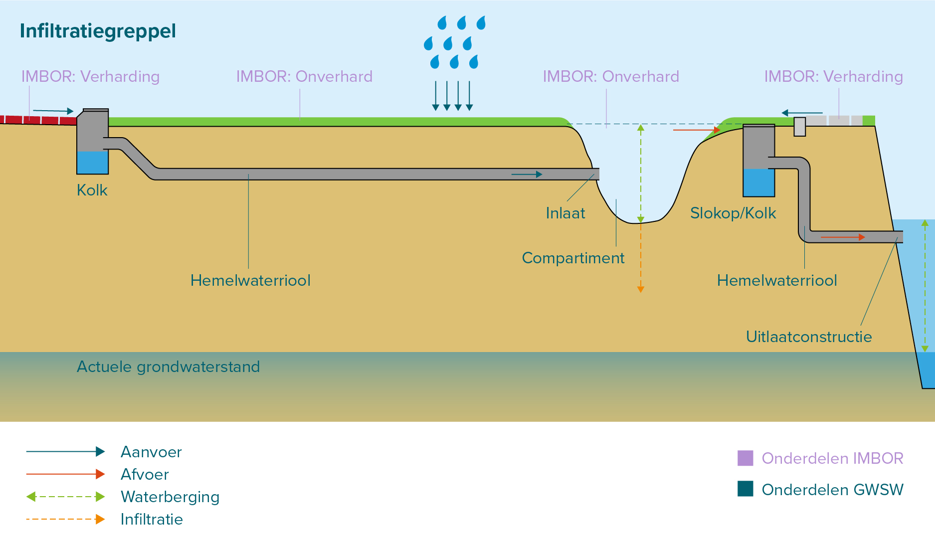
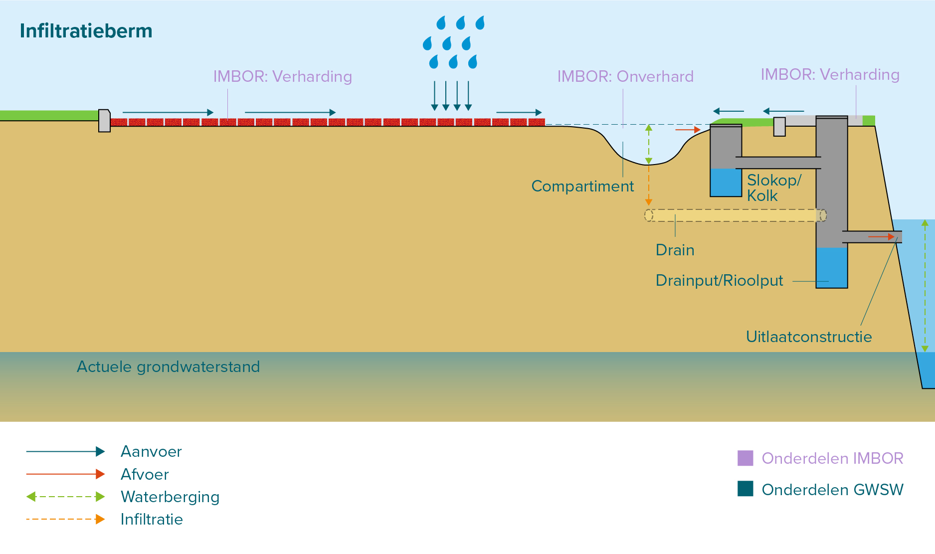
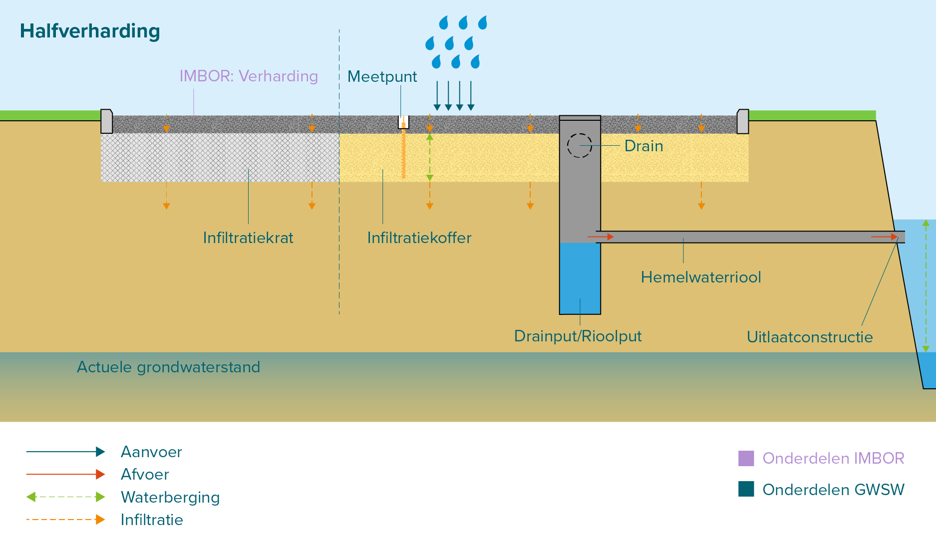
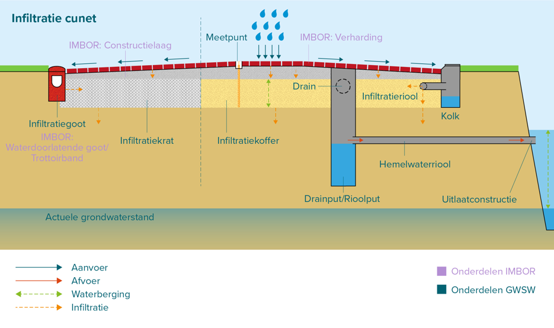

# Beheer Infiltratievoorzieningen

Stichting RIONED is initiatiefnemer en eigenaar van dit GitHub-project, Eric Oosterom is de verantwoordelijk projectmanager.

Vragen over deze website en het GWSW kunt u stellen via gwsw@rioned.org.

# Inleiding

## Aanleiding

Vanuit het programma hemelwatervoorzieningen van RIONED bestaat de behoefte aan goede beschrijvingen van (beheer van) infiltratievoorzieningen wat gebruikt kan worden om GWSW-definities op te stellen. De wens bestaat hierbij om:
- Een gemeenschappelijk beeld/taal te krijgen van/over infiltratievoorzieningen
- (de eerste) stappen worden gezet om het beheer van infiltratievoorzieningen op te nemen in beheerapplicaties

- Daarnaast bestaat op termijn de wens om ook de bescherming van infiltratievoorzieningen (via goed databeheer) ter verbeteren.

Aan Sweco (Elwin Leusink), infralytics (Wouter van Riel) en TAUW (Erwin Stamsnijder) is gevraagd dit verder inhoudelijk in te vullen in samenwerking met de begeleidingscommissie.

## Achtergrond en wens
Gemeenten geven aan dat infiltratievoorzieningen niet/heel beperkt in hun beheerapplicaties zijn opgenomen. Er zijn vragen over wat je moet opnemen onder ‘riolering’ en wat onder ‘groen’ en ‘wegen’, als je alle onderdelen van de voorziening goed wilt laten functioneren.

Gemeenten en bedrijven ervaren soms onduidelijkheid over de categorisering en definiëring van infiltratievoorzieningen. Bijvoorbeeld: is waterinfiltrerende verharding een categorie op zich zichzelf of is het eigenlijk een holle ruimte voorziening? Ander voorbeeld: een wadi is “Een (beplante) laagte, bestemd om het hemelwater tijdelijk te bergen en in de bodem te laten infiltreren. Voorzien van een infiltratiebed en veelal van infiltratiekratten.” Een infiltratiegreppel is “Een natuurlijk open reservoir met waterdoorlatende wanden voor de tijdelijke berging van hemelwater, waarbij het hemelwater door middel van infiltratie door de wanden kan worden afgevoerd.” Hierbij zien sommige gemeenten het infiltratiebed en de infiltratiekratten niet als noodzakelijk om het een wadi te laten zijn maar wel dat er een drain onder ligt. Dan lijkt het erg op de infiltratiegreppel. Men geeft aan dat er behoefte is aan een beschrijving die makkelijk te begrijpen is, zodat iedereen over hetzelfde praat (beleidsmedewerkers, ontwerpers, RO, beheerders, aannemers, etc.).

Tot slot ziet men dat de bescherming van infiltratievoorzieningen nog niet goed is geregeld. Waar leidingen via de Klic een vorm van bescherming hebben, is er niet zoiets voor infiltratievoorzieningen. Er zijn voorbeelden van wadi’s die dicht worden gegooid en kabels die door infiltratievoorzieningen worden getrokken.

Van daaruit bestaat er landelijk de behoefte om:
1. Het makkelijker te maken om gegevens over infiltratievoorzieningen op te nemen in beheerapplicaties.
2. Een heldere beschrijving en herkenbare definities te krijgen, binnen een duidelijke categorisering.
3. Opties beschrijven om (de werking van) infiltratievoorzieningen te beschermen door de locatie en werking te registeren.

## Aanpak op hoofdlijnen

### Beschrijving, definities, categorisering van infiltratievoorzieningen
In GWSW en de Kennisbank is een inhoudelijke basis gelegd over infiltratievoorzieningen en onderdelen. Deze informatie is echter niet overal volledig en sluit niet overal goed op elkaar aan. Op basis van hetgeen reeds beschikbaar is wordt binnen de opdracht gewerkt aan een visualisatie en beschrijving van de infiltratievoorzieningen en onderdelen. De  visualisatie heeft als doel de herkenbaarheid en het onderscheid van infiltratievoorzieningen te verbeteren. De definities en functies zijn bedoeld om een duidelijker onderscheid en categorisering aan te brengen waardoor de kennisbank en GWSW op termijn beter op elkaar aansluiten en de definities ook passen binnen GWSW.

Ten aanzien van de onderdelen zal nagegaan worden of hierin meer uniformering en vereenvoudiging mogelijk is. Een infiltratiekoffer verschilt bijvoorbeeld qua functie niet van een infiltratie-unit (behalve het kenmerk dat in de één aggregaat is aangebracht en de ander bestaat uit holle ruimte). Getracht zal worden de veelvoud aan onderdelen van infiltratievoorzieningen in overleg met de begeleidingscommissie (onderbouwd) te reduceren.

### Infiltratievoorzieningen en grondwatervoorzieningen in beheerapplicaties
Samen met de begeleidingscommissie worden wensen voor registratie van infiltratievoorzieningen geïnventariseerd:
- Wat is nodig voor goede registratie van de object- en systeemgegevens?
- Wat is daarvoor nodig in het GWSW? (Er zijn ‘basis’- gegevens nodig over ligging en inhoud, maar ook meetgegevens om het onderhoud goed uit te voeren. Wat is er exact nodig?)
- Wat is haalbaar om op te nemen in GWSW 1.7 (deadline maart 2025) of wat in een volgende GWSW-versie zal komen?

Vanuit deze inventarisatie wordt een voorstel gemaakt voor een exacte definitie, functie(s) en onderdelen van infiltratievoorzieningen. Deze worden zo opgesteld dat ze passen binnen GWSW en IMBOR en ook duidelijk is wat de aanpassing is t.o.v. de kennisbank en GWSW.

Daarnaast zal een voorstel worden gemaakt om wensen voor monitoring, onderhoud en beheerinformatie van infiltratievoorzieningen (bijvoorbeeld documentatie over de voorziening) een plek te geven binnen de GWSW.

### Fasering

1. Beschrijving voorzieningen vanuit fysiek en hydraulisch oogpunt
2. Afstemming van objecten in de openbare ruimte met CROW
3. Beschrijving van maatregelen aan infiltratievoorziening en benodigde informatiebehoefte, zoals ontwerptekeningen en porositeitsmetingen

## Beoogd eindresultaat

De werkzaamheden zullen leiden tot een voorstel voor:
- Visueel overzicht van alle hoofdtypen infiltratievoorzieningen met onderdelen
- Beschrijving van de definities en functies van infiltratievoorzieningen
- Beschrijving onderdelen van infiltratievoorzieningen

Daarnaast levert het een voorzet over hoe dit in het GWSW deelmodel en in het IMBOR dan zal moeten landen.

# Beoogde toepassing

- Uitbreiden van termen en definities: rijker maken van het woordenboek
- Beschrijving opstellen zodat hydraulische modellering van infiltratievoorzieningen mogelijk wordt
- Beschrijving zodat registratie van beheermaatregelen mogelijk zijn

# Afbakening

In het GWSW en de Kennisbank van Stichting RIONED staan verschillende benamingen, definities, functies en onderdelen van infiltratievoorzieningen. Voor meer inzicht in deze verschillen zijn deze hier uitgewerkt. Dit kan ook worden gebruikt als toelichting op keuzes voor naamgeving en definities van voorzieningen.

In onderstaande tabel staan de verschillende benamingen van infiltratievoorzieningen zoals deze nu in de Kennisbank en GWSW zijn beschreven.

| Type                          | Kennisbank                                                                                                                                                                                                                                                                                          | GWSW                                                                                                                      |
|-------------------------------|-----------------------------------------------------------------------------------------------------------------------------------------------------------------------------------------------------------------------------------------------------------------------------------------------------|---------------------------------------------------------------------------------------------------------------------------|
| Groene infiltratievelden      | <a href="https://www.riool.net/kennisbank/water-en-klimaat/stelsels-en-voorzieningen-in-het-stedelijk-watersysteem/voorzieningen-in-een-stedelijk-watersysteem/beschrijving-van-een-wadi" target="_blank">Wadi</a>                                                                                  | <a href="https://data.gwsw.nl/totaal/Wadi" target="_blank">Wadi</a>                                                       |
| Groene infiltratievelden      | <a href="https://www.riool.net/kennisbank/water-en-klimaat/stelsels-en-voorzieningen-in-het-stedelijk-watersysteem/voorzieningen-in-een-stedelijk-watersysteem/beschrijving-van-een-infiltratieveld" target="_blank">Infiltratieveld</a>                                                            |                                                                                                                           |
| Groene infiltratievelden      | <a href="https://www.riool.net/kennisbank/water-en-klimaat/stelsels-en-voorzieningen-in-het-stedelijk-watersysteem/voorzieningen-in-een-stedelijk-watersysteem/beschrijving-van-een-greppel" target="_blank">Greppel</a>                                                                            | <a href="https://data.gwsw.nl/totaal/Infiltratiegreppel" target="_blank">Infiltratiegreppel</a>                           |
| Groene infiltratievelden      | <a href="https://www.riool.net/kennisbank/water-en-klimaat/stelsels-en-voorzieningen-in-het-stedelijk-watersysteem/voorzieningen-in-een-stedelijk-watersysteem/beschrijving-van-een-infiltrerende-berm" target="_blank">Infiltratieberm* en (infiltrerende) berm</a>                                | <a href="https://data.gwsw.nl/totaal/Bermsloot" target="_blank">Bermsloot</a>                                             |
| Horizontale infiltratiebuizen | <a href="https://www.riool.net/kennisbank/water-en-klimaat/stelsels-en-voorzieningen-in-het-stedelijk-watersysteem/voorzieningen-in-een-stedelijk-watersysteem/beschrijving-van-een-infiltratieriool" target="_blank">Infiltratieriool</a>                                                          | <a href="https://data.gwsw.nl/totaal/Infiltratieriool" target="_blank">Infiltratieriool</a>                               |
| Verticale infiltratiebuizen   | <a href="https://www.riool.net/kennisbank/water-en-klimaat/stelsels-en-voorzieningen-in-het-stedelijk-watersysteem/voorzieningen-in-een-stedelijk-watersysteem/beschrijving-van-een-infiltratieput" target="_blank">Infiltratieput</a>                                                              | <a href="https://data.gwsw.nl/totaal/Infiltratieput" target="_blank">Infiltratieput</a>                                   |
| Verticale infiltratiebuizen   | <a href="https://www.riool.net/kennisbank/water-en-klimaat/stelsels-en-voorzieningen-in-het-stedelijk-watersysteem/voorzieningen-in-een-stedelijk-watersysteem/beschrijving-van-een-infiltratiekolk" target="_blank">Infiltratiekolk</a>                                                            | <a href="https://data.gwsw.nl/totaal/Infiltratiekolk" target="_blank">Infiltratiekolk</a>                                 |
| Holle ruimte voorzieningen    | <a href="https://www.riool.net/kennisbank/water-en-klimaat/stelsels-en-voorzieningen-in-het-stedelijk-watersysteem/voorzieningen-in-een-stedelijk-watersysteem/beschrijving-van-een-infiltratie-element" target="_blank">Infiltratie-unit* en Infiltratie-element</a>                               | <a href="https://data.gwsw.nl/totaal/Infiltratiekrat" target="_blank">Infiltratiekrat</a>                                 |
| Holle ruimte voorzieningen    | <a href="https://www.riool.net/kennisbank/water-en-klimaat/stelsels-en-voorzieningen-in-het-stedelijk-watersysteem/voorzieningen-in-een-stedelijk-watersysteem/beschrijving-van-een-infiltratie-element" target="_blank">Infiltratiekoffer* en Infiltratie-element</a>                              | <a href="https://data.gwsw.nl/totaal/Grindkoffer" target="_blank">Grindkoffer, Lavakoffer, Zandkoffer, Steenwolkoffer</a> |
| Infiltrerende wegconstructies | <a href="https://www.riool.net/kennisbank/water-en-klimaat/stelsels-en-voorzieningen-in-het-stedelijk-watersysteem/voorzieningen-in-een-stedelijk-watersysteem/beschrijving-van-een-infiltrerend-cunet" target="_blank">Waterdoorlatende verharding (poreuze steen)* en Infiltrerend Cunet</a>      |                                                                                                                           |
| Infiltrerende wegconstructies | <a href="https://www.riool.net/kennisbank/water-en-klimaat/stelsels-en-voorzieningen-in-het-stedelijk-watersysteem/voorzieningen-in-een-stedelijk-watersysteem/beschrijving-van-een-infiltrerend-cunet" target="_blank">Waterdoorlatende verharding (infiltrerende voeg)* en Infiltrerend Cunet</a> |                                                                                                                           |
| Infiltrerende wegconstructies | <a href="https://www.riool.net/kennisbank/water-en-klimaat/stelsels-en-voorzieningen-in-het-stedelijk-watersysteem/voorzieningen-in-een-stedelijk-watersysteem/beschrijving-van-een-infiltrerend-cunet" target="_blank">Halfverharding* en Infiltrerend Cunet</a>                                   |                                                                                                                           |
| Infiltrerende wegconstructies | <a href="https://www.riool.net/kennisbank/water-en-klimaat/stelsels-en-voorzieningen-in-het-stedelijk-watersysteem/voorzieningen-in-een-stedelijk-watersysteem/beschrijving-van-een-infiltrerend-cunet" target="_blank">Infiltrerend Cunet</a>                                                      |                                                                                                                           |

Op basis van bovenstaande tabel is in de volgende tabel voorstel opgenomen voor de voorzieningen in GWSW.

| Type                          | Voorstel GWSW                | Motivatie                                  |
|-------------------------------|------------------------------|--------------------------------------------|
| Groene infiltratievelden      | Wadi                         |                                            |
| Groene infiltratievelden      | Infiltratieveld              |                                            |
| Groene infiltratievelden      | Infiltratiegreppel           |                                            |
| Groene infiltratievelden      | Infiltratieberm              |                                            |
| Horizontale infiltratiebuizen | Infiltratierioolvoorziening  | Infiltratieriool is al bekend in het GWSW  |
| Verticale infiltratiebuizen   | Infiltratieputvoorziening    | Infiltratieput is al bekend in het GWSW    |
| Verticale infiltratiebuizen   | Infiltratiekolkvoorziening   | Infiltratiekolk is al bekend in het GWSW   |
| Holle ruimte voorzieningen    | Infiltratie-unit             |                                            |
| Holle ruimte voorzieningen    | Infiltratiekoffervoorziening | Diverse koffers zijn al bekend in het GWSW |
| Infiltrerende wegconstructies | Waterdoorlatende verharding  |                                            |
| Infiltrerende wegconstructies | Waterpasserende verharding   |                                            |
| Infiltrerende wegconstructies | Halfverharding               |                                            |
| Infiltrerende wegconstructies | Infiltratie Cunet            |                                            |

 

**Definities infiltratievoorzieningen**

In onderstaande tabel zijn de verschillende definities van infiltratievoorzieningen opgenomen zoals deze nu in de kennisbank en/of GWSW zijn beschreven.

| Voorziening                  | Definitie kennisbank                                                                                                                                                                                                                                                                                                                                                                                                                                                                                                                                                                                                                              | Definitie GWSW                                                                                                                                                                                                                                             | Voorstel definitie                                                                                                                                                                                                                                                                                                                                                    |
|------------------------------|---------------------------------------------------------------------------------------------------------------------------------------------------------------------------------------------------------------------------------------------------------------------------------------------------------------------------------------------------------------------------------------------------------------------------------------------------------------------------------------------------------------------------------------------------------------------------------------------------------------------------------------------------|------------------------------------------------------------------------------------------------------------------------------------------------------------------------------------------------------------------------------------------------------------|-----------------------------------------------------------------------------------------------------------------------------------------------------------------------------------------------------------------------------------------------------------------------------------------------------------------------------------------------------------------------|
| Wadi                         | Een wadi is een begroeide, onverharde verlaging in het maaiveld waarin het hemelwater wordt verzameld, dat vervolgens via een zuiverende bodempassage infiltreert in de ondergrond. Bij overlelasting heeft de verlaging een overloop. In de ondergrond heeft de wadi een drainageleiding en eventueel infiltratie-elementen.                                                                                                                                                                                                                                                                                                                     | Een verdiept terrein, bestemd om het hemelwater tijdelijk te bergen, voorzien van waterdoorlatende bodem waardoor water door middel van infiltratie door de bodem kan worden afgevoerd.                                                                    | Een begroeide, onverharde verlaging in het maaiveld, waarin het hemelwater tijdelijk wordt geborgen en via een waterdoorlatende (zuiverende) bodempassage infiltreert in de ondergrond. Bij overbelasting heeft de verlaging een overloop. In de ondergrond heeft de wadi een drainageleiding en eventueel infiltratiekoffer.                                         |
| Infiltratieveld              | Een infiltratieveld bestaat altijd uit een verlaging in het maaiveld (het bassin) en een doorlatende toplaag. Er zijn allerlei varianten mogelijk in omvang en inrichting. Het principe is altijd hetzelfde.                                                                                                                                                                                                                                                                                                                                                                                                                                      |                                                                                                                                                                                                                                                            | Een begroeide, onverharde verlaging in het maaiveld, waarin het hemelwater tijdelijk wordt geborgen en waarbij het hemelwater via een waterdoorlatende (zuiverende) bodempassage infiltreert in de ondergrond.                                                                                                                                                        |
| Infiltratiegreppel           | Greppels zijn onverharde geulen, vaak begroeid met gras, die gebruikt worden voor de afvoer van ingezameld hemelwater.                                                                                                                                                                                                                                                                                                                                                                                                                                                                                                                            | Een natuurlijk open reservoir met waterdoorlatende wanden voor de tijdelijke berging van hemelwater, waarbij het hemelwater door middel van infiltratie door de wanden kan worden afgevoerd.                                                               | Een begroeide, onverharde greppel / sloot, waarin het hemelwater tijdelijk wordt geborgen en via de bodem en wanden infiltreert in de ondergrond.                                                                                                                                                                                                                     |
| Infiltratieberm              | Een infiltrerende berm is een strook grond langs een weg, tussen rijstroken of tussen een rijweg en een fiets- of voetpad in die het afstromende hemelwater van de verharding ernaast laat infiltreren. Dit kan bedoeld zijn om (schoon) water niet af te voeren, om grondwater aan te vullen en ook om de beplanting in bermen van voldoende water te voorzien.                                                                                                                                                                                                                                                                                  |                                                                                                                                                                                                                                                            | Een begroeide, onverharde verlaging in een strook grond langs een weg, fiets- of voetpad, waarin het hemelwater tijdelijk wordt geborgen en via de bodem en wanden infiltreert in de ondergrond.                                                                                                                                                                      |
| Infiltratierioolvoorziening  | Het doel van een infiltratieriool is het in de bodem brengen en soms bergen van ingezameld hemelwater. Een infiltratieriool is een leiding met een buiswand waar water doorheen kan. De wand is gemaakt van poreus materiaal of er zijn openingen in de buiswand aangebracht. Hierdoor kan het water vanuit de buis via de wand in de bodem infiltreren.                                                                                                                                                                                                                                                                                          | Een rioolleiding met waterdoorlatende wanden bestemd voor de inzameling en transport van hemelwater, waarbij het hemelwater door middel van infiltratie door de wanden kan worden afgevoerd. Kan ook beschouwd worden als een soort infiltratievoorziening | Een horizontaal liggend infiltratieriool, waarin het hemelwater wordt ingezameld, getransporteerd, tijdelijk wordt geborgen en vervolgens via de wanden infiltreert in de bodem.                                                                                                                                                                                     |
| Infiltratieputvoorziening    | Infiltratieputten zijn verticaal in de grond geplaatste buizen van kunststof of beton die aan de onderzijde meestal open zijn. Vaak zijn de zijkanten voorzien van gaten of sleuven of zijn deze gemaakt van poreus materiaal, waardoor hemelwater in de omliggende bodem kan infiltreren. Infiltratieputten worden ook wel zink- of zakputten genoemd.                                                                                                                                                                                                                                                                                           | Een put met waterdoorlatende wanden bestemd voor de inzameling van hemelwater, waarbij het hemelwater door middel van infiltratie door de wanden kan worden afgevoerd                                                                                      | Een verticaal in de grond aangebrachte infiltratieriool of infiltratieput, waarin het hemelwater tijdelijk wordt geborgen en via de bodem en/of wanden infiltreert in de bodem.                                                                                                                                                                                      |
| Infiltratiekolkvoorziening   | Infiltratiekolken zijn kolken waarvan de onderbak is voorzien van openingen of van poreuze wanden en een poreuze bodem, waardoor het hemelwater in de ondergrond kan infiltreren.                                                                                                                                                                                                                                                                                                                                                                                                                                                                 | Een kolk met waterdoorlatende wanden bestemd voor de inzameling van hemelwater, waarbij het hemelwater door middel van infiltratie door de wanden kan worden afgevoerd. Kan ook beschouwd worden als een soort infiltratievoorziening.                     | Een infiltratiekolk, waarin het hemelwater tijdelijk wordt geborgen en via de bodem en wanden infiltreert in de ondergrond.                                                                                                                                                                                                                                           |
| Infiltratie-unit             | Infiltratie-elementen zijn ondergrondse voorzieningen die hemelwater bergen en van waaruit ingezameld hemelwater infiltreert in de omliggende bodem. Infiltratie-elementen hebben een holle ruimte in de poriën van een substraat, lavakorrels, steenwolelementen, grind, of tussen (geperforeerde) wanden.                                                                                                                                                                                                                                                                                                                                       | Een krat met waterdoorlatende wanden bestemd voor de inzameling van hemelwater, waarbij het hemelwater door middel van infiltratie door de wanden kan worden afgevoerd.                                                                                    | Een in de ondergrond aangebrachte bak met waterdoorlatende wanden, waarin het hemelwater tijdelijk wordt geborgen en via de bodem en wanden infiltreert in de ondergrond.                                                                                                                                                                                             |
| Infiltratiekoffervoorziening | Infiltratie-elementen zijn ondergrondse voorzieningen die hemelwater bergen en van waaruit ingezameld hemelwater infiltreert in de omliggende bodem. Infiltratie-elementen hebben een holle ruimte in de poriën van een substraat, lavakorrels, steenwolelementen, grind, of tussen (geperforeerde) wanden.                                                                                                                                                                                                                                                                                                                                       | Een grindkoffer is (meestal) een kuil met worteldoek, gevuld met grind waar regenwater de tijd krijgt om langzaam in de bodem opgenomen te worden**                                                                                                        | Een in de ondergrond aangebrachte koffer met substraat met een hoge porositeit, waarin het hemelwater via een drain wordt verdeeld over de koffer en daarin tijdelijk wordt geborgen en via de bodem en wanden infiltreert in de ondergrond.                                                                                                                          |
| Waterdoorlatende verharding  |                                                                                                                                                                                                                                                                                                                                                                                                                                                                                                                                                                                                                                                   |                                                                                                                                                                                                                                                            | Een verharding met een waterdoorlatende elementenverharding op een constructielaag, met daar direct onder een fundatie/cunet met substraat met een hoge porositeit. Na infiltratie door de verharding kan het hemelwater tijdelijk in het cunet worden geborgen, waarna het via de bodem en wanden van het cunet infiltreert in de ondergrond.                        |
| Waterpasserende verharding   |                                                                                                                                                                                                                                                                                                                                                                                                                                                                                                                                                                                                                                                   |                                                                                                                                                                                                                                                            | Een verharding met een waterpasserende elementenverharding op een constructielaag, met daar direct onder een fundatie/cunet met substraat met een hoge porositeit. Na infiltratie langs de vergrote voegen van de verharding kan het hemelwater tijdelijk in het cunet worden geborgen, waarna het via de bodem en wanden van het cunet infiltreert in de ondergrond. |
| Halfverharding               |                                                                                                                                                                                                                                                                                                                                                                                                                                                                                                                                                                                                                                                   |                                                                                                                                                                                                                                                            | Een halfverharding en eventueel cunet bestaande uit substraat met een hoge porositeit, waarin het hemelwater tijdelijk in het cunet wordt geborgen en via de bodem en wanden van het cunet infiltreert in de ondergrond.                                                                                                                                              |
| Infiltratiecunet             | Een cunet is de funderingslaag die wordt gebruikt onder verharding (bijvoorbeeld een weg). Een cunet wordt daarom heel vaak toegepast. De grond waarop een weg wordt aangelegd, wordt afgegraven om in plaats hiervan een meer draagkrachtige laag aan te kunnen brengen, het cunet. Het doel hiervan is het vergroten van de draagkracht ten behoeve van wat erboven ligt. Als voor dit wegcunet geschikt materiaal wordt gebruikt, kan het ook een boel water bergen. Er wordt vaak rondom een voorziening voor drainage of infiltratie ook een laag grond vervangen. In dat geval altijd door goed doorlatend materiaal. Ook dit is een cunet. |                                                                                                                                                                                                                                                            | Een traditioneel uitgevoerde verharding op een constructielaag, met daar direct onder een fundatie/cunet met substraat met een hoge porositeit. Het hemelwater wordt via kolken met infiltratieriool en/of permeogoten in het cunet gebracht en geborgen, waarna het via de bodem en wanden van het cunet infiltreert in de ondergrond.                               |

De beschijving van de infiltratievoorzieningen focust het perspectief van de hydraulische opbouw van een voorziening. Dat houdt in: de voorziening is het geheel der delen, waarbij ieder onderdeel apart wordt beschreven en zijn eigen hydraulische kenmerken heeft. Hiermee wordt het mogelijk om de hydraulische werking van de gehele voorziening te schematiseren.

# Soorten infiltratievoorzieningen

In onderstaande paragrafen zijn diverse infiltratievoorzieningen gevisualiseerd. Alle termen die in de visualisaties voorkomen, komen uit het GWSW. Op sommige plaatsen komen termen uit het <a href="https://imbor-viewer.apps.crow.nl" target="_blank">IMBOR</a> voor. Dit is dan ook expliciet aangegeven.

In de visualisatie staan pijlen met diverse kleuren. In onderstaande legenda is de betekenis weergegeven.

## Wadi
 

Definitie Wadi

Een begroeide, onverharde verlaging in het maaiveld, waarin het hemelwater tijdelijk wordt geborgen en via een waterdoorlatende (zuiverende) bodempassage infiltreert in de ondergrond. Bij overbelasting heeft de verlaging een overloop. In de ondergrond heeft de wadi een drainageleiding en eventueel infiltratiekoffer.

## Infiltratieveld
 

Definitie Infiltratieveld

Een begroeide, onverharde verlaging in het maaiveld, waarin het hemelwater tijdelijk wordt geborgen en via een waterdoorlatende (zuiverende) bodempassage infiltreert in de ondergrond.

## Infiltratiegreppel
 

Definitie Infiltratriegreppel

Een begroeide, onverharde greppel / sloot, waarin het hemelwater tijdelijk wordt geborgen en via de bodem en wanden infiltreert in de ondergrond.

## Infiltratieberm
 

Definitie Infiltratieberm

Een begroeide, onverharde verlaging in een strook grond langs een weg, fiets- of voetpad, waarin het hemelwater tijdelijk wordt geborgen en via de bodem en wanden infiltreert in de ondergrond.

## Infiltratierioolvoorziening
 

Definitie Infiltratierioolvoorziening

Een horizontaal liggend infiltratieriool, waarin het hemelwater wordt ingezameld, getransporteerd, tijdelijk wordt geborgen en vervolgens via de wanden infiltreert in de bodem.

## Infiltratieputvoorziening
 

Definitie Infiltratieputvoorziening

Een verticaal in de grond aangebrachte infiltratieriool of infiltratieput, waarin het hemelwater tijdelijk wordt geborgen en via de bodem en/of wanden infiltreert in de bodem.

## Infiltratiekolkvoorziening
 

Definitie Infiltratiekolkvoorziening

Een infiltratiekolk, waarin het hemelwater tijdelijk wordt geborgen en via de bodem en wanden infiltreert in de ondergrond.

## Infiltratie-unit
 

Definitie Infiltratie-unit

Een in de ondergrond aangebrachte bak met waterdoorlatende wanden, waarin het hemelwater tijdelijk wordt geborgen en via de bodem en wanden infiltreert in de ondergrond.

## Infiltratiekoffervoorziening
 

Definitie Infiltratiekoffervoorziening

Een in de ondergrond aangebrachte koffer met substraat met een hoge porositeit, waarin het hemelwater via een drain wordt verdeeld over de koffer en daarin tijdelijk wordt geborgen en via de bodem en wanden infiltreert in de ondergrond.

## Waterdoorlatende verharding
 

Definitie Waterdoorlatende verharding

Een verharding met een waterdoorlatende elementenverharding op een constructielaag, met daar direct onder een fundatie/cunet met substraat met een hoge porositeit. Na infiltratie door de verharding kan het hemelwater tijdelijk in het cunet worden geborgen, waarna het via de bodem en wanden van het cunet infiltreert in de ondergrond.

## Waterpasserende verharding
 

Definitie Waterpasserende verharding

Een verharding met een waterpasserende elementenverharding op een constructielaag, met daar direct onder een fundatie/cunet met substraat met een hoge porositeit. Na infiltratie langs de vergrote voegen van de verharding kan het hemelwater tijdelijk in het cunet worden geborgen, waarna het via de bodem en wanden van het cunet infiltreert in de ondergrond.

## Halfverharding
 

Definitie Halfverharding

Een halfverharding en eventueel cunet bestaande uit substraat met een hoge porositeit, waarin het hemelwater tijdelijk in het cunet wordt geborgen en via de bodem en wanden van het cunet infiltreert in de ondergrond.

## Infiltratiecunet
 

Definitie Infiltratiecunet

Een traditioneel uitgevoerde verharding op een constructielaag, met daar direct onder een fundatie/cunet met substraat met een hoge porositeit. Het hemelwater wordt via kolken met infiltratieriool en/of permeogoten in het cunet gebracht en geborgen, waarna het via de bodem en wanden van het cunet infiltreert in de ondergrond.

# Wijzigingen in het GWSW
In deze paragrafen worden de wijzigingen voor het GWSW gepresenteerd.

Onderstaand schema biedt een overzicht van de wijzigingen in de soortenboom voor infiltratievoorzieningen.

## Concepten, kenmerken en relaties

